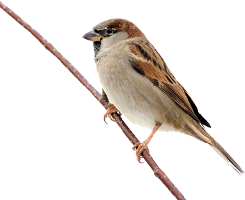

```{r setup, include=FALSE}
# this is a comment, it will be ignored
knitr::opts_chunk$set(echo = TRUE)
```


# Iris data set analysis

## Summary of the data set

```{r iris}
data(iris)
summary(iris)
```

## Boxplot of sepal widths depending on the species

```{r}
boxplot(Sepal.Width ~ Species, data = iris)
```

(please read again about box plots here:
https://www.nature.com/articles/nmeth.2837
https://www.nature.com/articles/nmeth.2813


)

## simple plot


```{r}
library(ggplot2)
## your first ggplot graphics
ggplot(iris, aes(x = Sepal.Width, y = Sepal.Length, color = Species)) +
  geom_point()
```


```{r}
library(ggplot2)
## your first ggplot graphics
ggplot(iris, aes(x = Petal.Width, y = Petal.Length, color = Species)) +
  geom_point()
```

## Dimension reduction: Principal Component Analysis

Calculate the principal components

```{r}
pca <- prcomp(iris[,1:4], scale.=TRUE)
```

Create a data frame with both, original data, and the new principal components

```{r}
df <- cbind(iris, pca$x)
```

Create a plot of principal components:

```{r}
ggplot(df, aes(x = PC1, y = PC3, color = Species)) +
  geom_point()
```


# Section

## R Markdown

### Subsubsection

#### etc

Text with a footnote^[This is the footnote.].

This is an R Markdown document. Markdown is a simple formatting syntax for authoring HTML, PDF, and MS Word documents. For more details on using R Markdown see <http://rmarkdown.rstudio.com>.

This will be **bold**, and this will be *italics*.

And here comes a list:

 - one
 - two
 - three

You can also use stars:

 * one
 * two
 * three (and of course *italic* or **bold** work)
 
And a numbered list:

 1. one
 2. two
 3. three

When you click the **Knit** button a document will be generated that includes both content as well as the output of any embedded R code chunks within the document. You can embed an R code chunk like this:

```{r cars}
data(iris)
summary(iris)
```


| column1| column2 |column3 |
|-------|------- |------- |
|test1| test2| test3|

## Tables with R

```{r}
iris_first_10 <- head(iris, n = 10)
knitr::kable(iris_first_10)
```


## Including Plots

You can also embed plots, for example:

```{r pressure, echo=FALSE}
plot(pressure)
```

Note that the `echo = FALSE` parameter was added to the code chunk to prevent printing of the R code that generated the plot.

## Images




