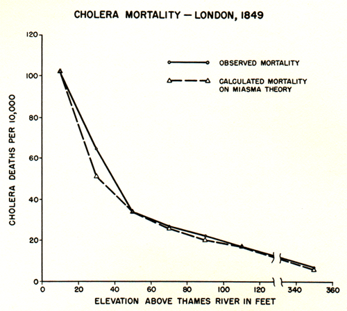
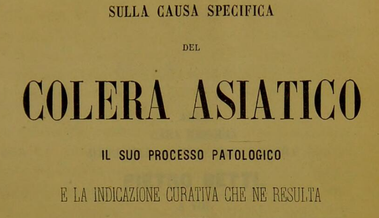
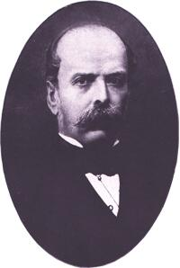
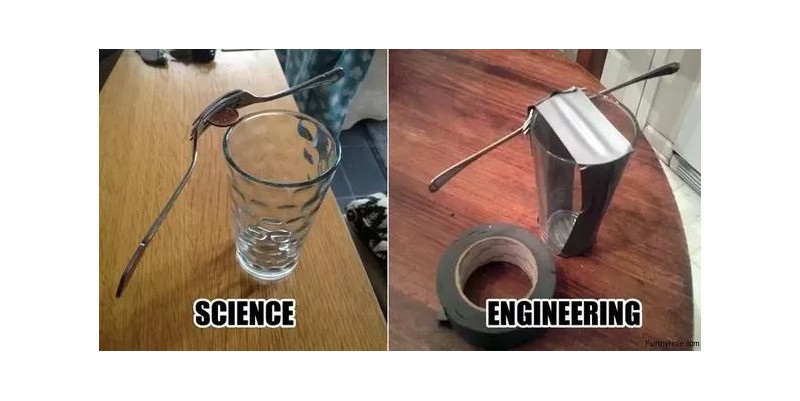
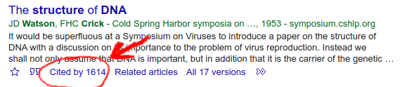
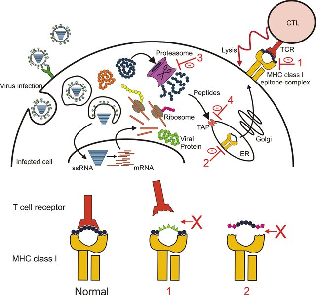
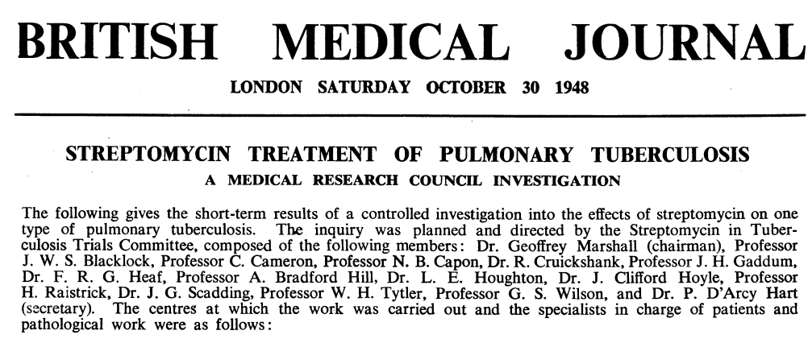

```{r,echo=FALSE}
## Set default options for the knitr RMD processing
knitr::opts_chunk$set(echo=FALSE,warning=FALSE,message=FALSE,fig.width=5,fig.height=5,cache=FALSE,autodep=TRUE, results="hide")
```

```{r libraries,cache=FALSE}
```

## Berlin Institute of Health

.pull-left[

 * Institute for translational and precision medicine

 * Founded in 2013 by Max Delbrück Center for
   Molecular Medicine and Charité – a university hospital affiliated with
   both Humboldt University and Free University Berlin.

 * Since 2020 a part of the Charité

]


???

Charité – over 15,000 employes

---

## A few words about myself

Short bio:

 * PhD in molecular biology 
 * 2003-2009 evolutionary bioinformatics (sequence analyses, phylogeny, teaching)
 * 2009-2019 Max Planck for Infection Biology – tuberculosis, Omics, statistics, clinical trials
 * Since 2019 at the Core Unit for Bioinformatics, BIH, Charité

Areas of expertise:

 * biostatistics, R
 * functional analysis
 * evolutionary biology

---

## Organisatory matters

 * Wednesdays: lecture ("theory"): 1h35 with a 5' break + discussion
 * Thursdays: guided exercise ("practice"): 1h45m with a 15' break

???

what is the difference between this course and an online course from say
Coursera?

---

## Lecture files

 * Lectures are in HTML format
 * Generated from Rmarkdown
 * You will find a ZIP archive with the lecture files, including the
   Rmarkdown
 * Unzip the file and open in a browser (Chrome or Firefox preferred)
 * See [keyboard shortcuts](https://bookdown.org/yihui/rmarkdown/xaringan-key.html)
 * Important slides / concepts marked with ✪

---

## Course evaluation ✪

 * Homeworks (short and easy) 30%
 * Report ("paper") 30%
 * Exam (multiple choice) 40%

Rule #1: no plagiarism


*Final information TBA*

---

## General advice

 1. Ask questions.
--

 2. **ASK** questions.
--

 3. Take notes, don't rely on lecture materials.
--

 4. Try things on your own.


---

## Let me tell you a story

---
class:empty-slide,myinverse
background-image:url(images/Slum-pic-1-Wikipedia.jpg)

???

London in the 1850s: Irland immigration, slums, exponential population
growth, from 1 million in 1800 to over 2 in 1850 and 4 in 1900

---
class:empty-slide,myinverse
background-image:url(images/Slum-pic-4.jpg)

???

  The rookeries

---
class:empty-slide,myinverse
background-image:url(images/Slum-pic-3.jpg)

---

## London cholera epidemics

 * 1831-32: 30 thousand deaths
 * 1850-52: 50 thousand deaths
 * 1853: 10 thousand deaths

---

## The miasma theory of cholera



???

Florence Nightingale, William Farr (regarded as the father of medical
statistics)

---

## Alternative explanation

.pull-left[
**John Snow** – 1813-1858, physycian, early anaesthesiologist
]

--

.pull-right[

]


---

## Alternative explanation

.pull-left[
**John Snow** – 1813-1858, physycian, early anaesthesiologist

Observations:

 * cholera is linked to the digestive tract
 * it appears that it is contagious

Speculations:

 * the "cholera poison" must somehow multiply
 * possibly it multiplies in the digestive tract
 * faeces contaminates drinking water with "cholera poison"

However:

 * In 1831, two German physicians tried to test contagiousness by drinking
   faeces of a cholera patient
 * epidemies come and go, despite of the water still being contaminated
]


.pull-right[

]

---

## Testing the hypothesis

 * Collecting cases in which neighborhoods differed with respect to cholera
   outbreaks, predicting that they would have a different water supply
 * This required testing the water to determine the supplier
 * Also suggested switching the supplier, which had an effect on the
   epidemic
 * Used William Farrs data on cholera epidemics

???

two water suppliers had particularly dirty water

case when two "courts" one with epidemic second without, different water
suppliers

---

## Broad Street epidemics

In 1854, a serious outbreak occured in Soho (eventually, more than 600
people died all in the same neighborhood)

---

## Broad Street epidemics

.pull-left[

]

.pull-right[
 * Snow created a map combining geographical information with statistical
   data – deaths were represented as stack bars
]

---

## Broad Street epidemics

.pull-left[

]


.pull-right[
 * He then went on to include information on the nearest avaialble water
   source – a pump – by delineating boundaries between the regions close to
   one or another pump (this is called a Voronoi✪  diagram)

]


---

## Broad Street epidemics

.pull-left[

]


.pull-right[
 * He then went on to include information on the nearest avaialble water
   source – a pump – by delineating boundaries between the regions close to
   one or another pump (this is called a Voronoi✪ diagram)

]

???

Additionally, none of the workers who worked at a local brewery contracted
cholera.

Pump was then disabled by the authorities, but this is unlikely to be the
cause of the end of the epidemics

Later it was found that an old abandoned cesspit was leaking

---

## Broad street pump

.pull-left[

  * Board of Health attributed the outbreak to miasma


  * In 1854, italian scientist Filippo Pacini discovered the cholera
    bacterium, but *no-one noticed*


  * Snow died in 1858 due to a stroke


  * In 1866, William Farr realised during another outbreak that he was wrong
   after all (although he still did not believe in the "cholera poison")

  * In 1884, Robert Koch discovered and named *Vibrio cholerae*, showing
    that it causes cholera, and *everyone* noticed

]

.pull-right[

]


???

The problem most people had with the fecal-oral route

---

## The real cause of cholera

.pull-left[


]

.pull-right[
Pacini discovered *Vibrio cholera* in 1854, 30 years before Koch
did the same (and became famous for it).




]

---

## Lessons from this story

 * That may have been a very early case of "bioinformatic analysis"
 * You may be right, but you need to convince others
 * You may be right, but still have no impact on science – you need to
   communicate it to the right crowd (other example: Gregor Johann Mendel)
 * An old theory is hard to kill
 * A good "story" helps (everybody knows about the pump)
 * A good visualization is not only for presenting data, but also for
   exploring it

---


## So, what is bioinformatics?

.left[

]

.right[
*If bioinformatics was an animal...*
]

---

## Defining bioinformatics by the areas of research✪ 

(also, incidentally, plan for our course)

--

.pull-left[

 * Sequence analysis

   * Sequence alignments and sequence similarity
   * Sequence search
   * Motifs
   * Phylogenies and evolution
] 

--

.pull-right[
 * Protein structures

    * Protein structure prediction
    * Visualizations

]

--

.pull-left[

 * Omics data analysis

    * Transcriptomics
    * Functional analysis
]

--

.pull-right[
 * Data science

    * Data management in biology
    * Data visualisation – a primer
]

--

.pull-left[


 * Machine learning
  
    * Basic concepts
    * Simple approaches
]


---

## Defining bioinformatics by tools of the trade✪ 

The easiest thing: programming skill

 * Python or R?
 * Multilinguality pays off: learn at least the rudiments of HTML, bash, C, GNU
   make, snakemake to be able to install the tools of your trade
 * Learn how to efficiently use a terminal: use Linux / MacOS / Linux
   Subsystem for Windows (LSW)
 * Learn to use SSH, git, github / gitlab, markdown
 * Learn how to visualize data (with R or Python)
 * **Learn to touch-type, as you will be typing A LOT**

---

## Scientific skills

 * Bioinformatics is an area of science rather than technology
 * "Figure out how it works" rather than "build it"




---

## Scientific skills

 * Bioinformatics is an area of science rather than technology
 * "Figure out how it works" rather than "build it"


---

## Scientific skills✪ 

 * Who is a scientist?
    * Read scientific papers
    * Learn how to write scientific papers
 * Understanding biology makes you a much better bioinformatician
 * Learn about scientific reasoning, hypothesis testing etc.

.pull-right[

]

???

Scientist is a person who reads *and writes* scientific papers.

--- 

## The art of fast reading of scientific papers

 * Search for papers using [google scholar](https://scholar.google.com) or
   [PubMed](https://pubmed.ncbi.nlm.nih.gov)
 * Use forward search!
 * Start with review articles, easier to read and will allow you to get
   into the subject
 * Most papers have Abstract, Introduction, Methods, Results and Discussion
 * Fastest method: look at the last sentence of an abstract, and maybe at
   the end of "Conclusions" if it is present
 * Second fastest: look at the figures
 * Third fastest: read the introduction and discussion, then check the
   results while they are discussed
 * If you want to *cite* a paper, you *must* read it in whole

 * **DON'T TAKE THE AUTHORS BY THEIR WORD!** Try to find their errors /
   mistakes / omissions, ask "what if", or even "they must be joking"
 * **BE CAREFUL OF PRE-PRINTS, HERE BE DRAGONS**




---

## Statistical skills

 * Statistics *is* hard.
 * Proper statistics is harder.
 * Science is in a reproducibility crisis, statistical methods are at the
   core of it.
 * Good bioinformatics means good reproducibility means good science

.pull-right[

]

---

## Story time

 1. Biomarkers of tuberculosis (TB) progression

 2. Functional analysis in a vaccine trial

 3. Genetic background in severe COVID-19

---

## 1. Biomarkers of TB progression

---

class:empty-slide,mywhite
background-image:url(images/tuberculosis.png)

???

1.4 mln deaths in 2019
10 mln new patients in 2019
400 thousand with MDR TB

---

class:empty-slide,mywhite
background-image:url(images/tuberculosis_2.png)

---

class:empty-slide,mywhite
background-image:url(images/study_scheme.png)

---

Go to [manuscript](https://www.nature.com/articles/s41467-018-07635-7)


---

## 2. Transcriptomic responses in vaccination

---
class:empty-slide,mywhite
background-image:url(images/transcriptomics.png)

---

## ✪ How to make sens from thousands of results?

.pull-left[

]

.pull-right[
* How do you make sense of a list of 1000 genes?


* What if there are none, can you still say something?

* What about missing functions?
]

---

## Gene set enrichments ✪

 * Categorize genes into sets of related function
 * Instead of asking whether a single gene is regulated, ask whether the
   sets (as a whole) is regulated

Advantages:

 * There are fewer sets than genes
 * Sets often have well understand biological functions

---


.footnote[*Zyla J, Marczyk M, Domaszewska T, Kaufmann SH, Polanska J, Weiner
3rd J. Gene set enrichment for reproducible science: comparison of CERNO
and eight other algorithms. Bioinformatics. 2019 Dec 15;35(24):5146-54.*]

---


---


.pull-left[Vaccine with an adjuvant]

.pull-right[Vaccine without an adjuvant]

.footnote[*Weiner, January, et al. "Characterization of potential biomarkers
of reactogenicity of licensed antiviral vaccines: randomized controlled
clinical trials conducted by the BIOVACSAFE consortium." Scientific reports
9.1 (2019): 1-14.*]


---


## 3. HLAs and COVID-19 severity

---


.footnote[*Once Upon a Time... Life*]

---

## Example of a real world study: HLAs and Covid

.pull-left[
Is severe COVID-19 associated with a genetic background?


]


--

.pull-right[

HLA ("human leukocyte antigen") – molecule which binds and presents antigens to immune cells

 * There are different HLA genes
 * Each gene comes in different variants – alleles
 * Different alleles may be better or worse at "catching" an antigen
 * There is a huge variability of HLAs in humans (that is why it is so hard
   to transplant an organ)

]


---

## Genetic association testing ✪

 * Test whether a *phenotype* (e.g. severe disease) occurs frequently in
   connection with a *genotype* (e.g. a particular allele)

Sounds straightforward:

 * Take samples from COVID patients at the Charité
 * Determine their HLA alleles
 * Compare with who has been intubated and who was not

.footnote[*Weiner, J. et al. "HLA-C 04: 01 is a Genetic Risk Allele for Severe Course of COVID-19." medRxiv (2020).*]

---

## Example of a real world study: HLAs and Covid


.footnote[*Weiner, J. et al. "HLA-C 04: 01 is a Genetic Risk Allele for Severe Course of COVID-19." medRxiv (2020).*]

---

## Example of a real world study: HLAs and Covid


.footnote[*Weiner, J. et al. "HLA-C 04: 01 is a Genetic Risk Allele for Severe Course of COVID-19." medRxiv (2020).*]

---

## Real world vs Randomized Controlled trial (RCT) ✪

.pull-left[

"Real world" (observational) studies:

 * Compare existing groups: e.g. people who consume olive oil and people
   who do not. Does olive oil reduce cancer rates?

 * Problem: comparing apples to oranges
  * problems finding matching controls
  * unknown biases

 * unplanned comparisons
  * the cherry-picking Pandora box

]

--

.pull-right[

RCT:


 * volunteers randomized in two groups
  * groups have now identical characteristcs
  * no bias due to group selection possible
 * planned comparisons prevent cherry-picking




*first RCT published – 1948*

]

???

 - Fisher published his book in 1935
 - Ethics: streptomycin was scarce anyway


