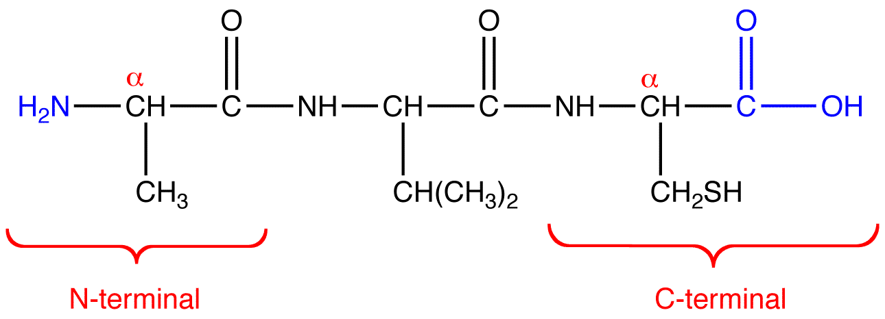
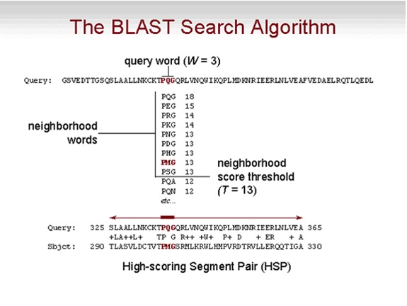

```{r,echo=FALSE}
## Set default options for the knitr RMD processing
knitr::opts_chunk$set(echo=FALSE,warning=FALSE,message=FALSE,fig.width=5,fig.height=5,cache=FALSE,autodep=TRUE, results="hide")
```

```{r libraries,cache=FALSE}
library(tidyverse)
```

---
class:empty-slide,myinverse
background-image:url(images/joaquin_phoenix.jpg)

---

## The art of fast reading of scientific papers ✪  

 * Search for papers using [google scholar](https://scholar.google.com) or
   [PubMed](https://pubmed.ncbi.nlm.nih.gov)
 * Use forward search!
 * Start with review articles, easier to read and will allow you to get
   into the subject
 * Most papers have Abstract, Introduction, Methods, Results and Discussion
 * Fastest method: look at the last sentence of an abstract, and maybe at
   the end of "Conclusions" if it is present
 * Second fastest: look at the figures
 * Third fastest: read the introduction and discussion, then check the
   results while they are discussed
 * If you want to *cite* a paper, you *must* read it in whole

 * **DON'T TAKE THE AUTHORS BY THEIR WORD!** Try to find their errors /
   mistakes / omissions, ask "what if", or even "they must be joking"
 * **BE CAREFUL OF PRE-PRINTS, HERE BE DRAGONS**


???

Whether you are going to be scientists or not, you need to have learned how
to read and write scientific papers

---

## Where to find papers which are not online?

 * "Preprint" archives (BioArxiv, MedArxiv)
 * "Self-archived" versions, e.g. on ResearchGate
 * "Unpaywall" – fully legal: automatically searches for self-archived manuscripts
 * Twitter hashtag `#icanhazpdf`
 * "Sci-hub" – [illegal](https://libreas.eu/ausgabe30/steinhauer/);
   "Nutzung unbedenklich" – you are not exactly forbidden to use it for
   reading (it is a grey-area), but don't save or print anything. 

---

## Sequences and sequence searches

.pull-left[
 * Nucleotide sequences:
 
```
5'-ACCCGTAAAG-3'

5'-AAAAA...AAAA-3'

5'-TAA-3' (fig. on the right)
```
]

.pull-right[

]

---

## Sequences and sequence searches

 * Amino acid sequences:
 
```
5'-Ala-Val-Cys-3' (fig. below)

5'-AVC-3' (fig. below)
```



---

## Sequences and sequence searches


---

## Why do we have to search for sequences?

 * identify the organism from which a sequence comes from
 * find similar sequences
    * Similarity -> common ancestry -> common function
 * technical reasons: PCR, RNA-Seq etc.

---

## Homology, common ancestry and function ✪  

 * Homology: identity by descent -> if and only if there is a common
   ancestor

     * We can determine homology only by considering *phylogeny*
     * Homologous sequences often have similar functions, but exceptions
       are aplenty
--

 * Similarity: something we can easily calculate with a computer by doing
   an *alignment*

     * Similarity may indicate homology, but is not the same
     * Homologous sequences may not be very similar (e.g. large
       evolutionary distances)
     * Similar sequences (esp. short) may be result of chance, convergence or 
       structural constraints (e.g.  coiled-coil structures)
--

 * When we calculate the similarity between two sequences, we need some
    sort of statistics to figure out whether 

---

## More on homology ✪

.pull-left[


]

.pull-right[

There are specific types of homology:

 * **orthology**: sequences are created by
   a speciation event. For example, alpha hemoglobin in humans and chimps
     * Very often, orthologous sequences have similar functions

]

--

.pull-right[
 * **paralogy**: sequenes are created by a duplication event in the genome.
   E.g., human alpha hemoglobin and human beta hemoglobin
     * Very often, paralogs have different function, for example due to
       neofunctionalization or subfunctionalization

]

More on these topics later.


---

## If sequences are similar, are they homologous? ✪


 * Similarity is a good indicator of homology
 * *Lack of similarity* is not a good indicator of *lack of homology*
 * To know for sure, you need to dive into phylogenetic reconstructions


---

## Why do we need to make alignments? ✪

Sequences always differ:

 * evolution -> mutations
 * post-processing (e.g. transcript isoforms)
 * sequencing errors

 => you cannot search by simple "Find"!

---

## Sequence alignments ✪

Examples of alingments of sequences `ACTTGA` and `ACCTGGA`

```
ACTTG-A    ACTT-GA     AC-TTG-A    ---ACTTGA    ACTTGA-------
|| || |    || | ||     || | | |         | ||
ACCTGGA    ACCTGGA     ACCT-GGA    ACC--TGGA    ------ACCTGGA
```

This is not a correct alignment (but may make sense in a different context):

```
ACTTG--A
|| ||  |
ACCTG-GA
```

---

## Do not confuse alignments with complementary sequences

.pull-left[
Alignment:

```
5'-ACTTG-A-3'
   || || |
5'-ACCTGGA-3'
```
]

.pull-right[
Complementary sequence:

```
5'-ACTTGGA-3'
   |||||||
3'-TGAACCT-5'
```
]

---

## Dot plots ✪

```
                         

        A C G G T A      
      A *         *      
      C   *              
      G     * *          
      T         *        
      A *         *      
                         
                         
                         
                         
                                                         
```


---

## Dot plots

```
                         Duplication        

        A C G G T A        A C G G T A      
      A *         *      A *         *      
      C   *              C   *              
      G     * *          G     * *          
      T         *        T         *        
      A *         *      A *         *      
                         C   *                            
                         G     * *                        
                         T         *                      
                         A *         *                    
                                                         
```


---

## Dot plots

```
                         Duplication        Insertion / Deletion

        A C G G T A        A C G G T A        A C G G G G G G T A 
      A *         *      A *         *      A *                 * 
      C   *              C   *              C   *                 
      G     * *          G     * *          G     * * * * * *     
      T         *        T         *        T                 *   
      A *         *      A *         *      A *                 * 
                         C   *                            
                         G     * *                        
                         T         *                      
                         A *         *                    
                                                         
```

---

## Dot plots


---

## Dot plots


---

## How dot plots work

.pull-left[

]

.pull-right[

]

---

## How dot plots work

.pull-left[

]

.pull-right[
This is the theory: neat lines where similarity occurs
]


---

## How dot plots work

.pull-left[

]

.pull-right[
This is the reality: a dot every time when there is a match, and there are
so many single nucleotide matches
]


---

## How dot plots work

.pull-left[

]

.pull-right[

]


---

## How dot plots work

.pull-left[

]

.pull-right[

]


---

## How dot plots work

.pull-left[

]

.pull-right[

]


---

## How dot plots work

.pull-left[

]

.pull-right[

]


---

## How dot plots work

.pull-left[

]

.pull-right[

]


---

## How dot plots work

.pull-left[

]

.pull-right[

]


---

## How dot plots work

.pull-left[

]

.pull-right[

]


---

## How dot plots work

.pull-left[

]

.pull-right[

]


---


## Needleman-Wunsch algorithm

 * Possibly the most famous algorithm in bioinformatics
 * Still used if you want to have an exact alignment
 * Go on, try to implement it!

```{r, fig.width=12,fig.height=5,results="asis"}
a1 <- "A-CCCGGT"
a2 <- "ACCCGG-T"
source("functions.R")

template <- "

---

## Alignments as paths in the matrix

\n```{r fig.width=15,fig.height=8}
plot_nw(a1, a2, i)
\n```

"

for(i in c(0:3,8)) { cat(knitr::knit_child(text=template,quiet=TRUE)) }

a1 <- "ACCCGGT-------"
a2 <- "-------ACCCGGT"

for(i in c(0:3,7:9,14)) { cat(knitr::knit_child(text=template,quiet=TRUE)) }


```

---

## Step 1: create a score matrix

```{r, fig.width=15,fig.height=8}
a1 <- "ACC-GT"
a2 <- "ACCGGT"

plot_nw(a1, a2, n=0, plot_mtx=TRUE)
```

---

## Step 2: calculate edit operations

 * "Moving" horizontally or vertically means including a gap, hence: gap penalty!) – e.g. -1

```
   A | C | T ...
--------------
A|   ->  |                       A C T ...
--------------                   |
C|   |   |   | ...               A - ....
```


 * "Moving" diagonally means we are getting the score in the matrix (here: 0 or 1)


---

## Step 2: calculate edit operations

```{r results="asis"}
template <- "

---
## Step 2: calculate edit operations

\n```{r fig.width=15,fig.height=8}
plot_nw(a1, a2, n=0, show_arrows_horiz=i)
\n```

"

for(i in c(1,2,4,6)) { cat(knitr::knit_child(text=template,quiet=TRUE)) }
```

---

## Step 2: calculate edit operations

```{r results="asis"}
template <- "

---
## Step 2: calculate edit operations

\n```{r fig.width=15,fig.height=8}
plot_nw(a1, a2, n=0, show_arrows_horiz=7, show_arrows_vert=i)
\n```

"

for(i in c(1,2,4,7)) { cat(knitr::knit_child(text=template,quiet=TRUE)) }
```

---

## Step 2: calculate edit operations

```{r results="asis"}
template <- "

---
## Step 2: calculate edit operations

\n```{r fig.width=15,fig.height=8}
plot_nw(a1, a2, n=0, show_arrows_diag=i, plot_mtx=TRUE)
\n```

"

for(i in c(1,2,4,7)) { cat(knitr::knit_child(text=template,quiet=TRUE)) }
```


---

## Step 2: calculate edit operations

```{r fig.width=15,fig.height=8}
plot_nw(a1, a2, n=0, show_arrows_diag=100, show_arrows_vert_all=TRUE, show_arrows_horiz_all=TRUE)
```

---

## Step 2: calculate edit operations

.pull-left[

```{r fig.width=8,fig.height=8}
plot_nw(a1, a2, n=6, plot_mtx=FALSE, show_arrows_vert_all=TRUE, show_arrows_horiz_all=TRUE, show_arrows_diag=100, nomargin=TRUE)
```

]

.pull-right[

Note: if you add the scores along the arrows, you will get the score of the
alignment!

1 + 1 + 1 - 1 + 1 + 1 = 4

Here the alignment:

```
ACC-GT
||| ||
ACCGGT
```

Five matches minus one gap = 4, indeed.

]

---

## Step 2: calculate edit operations

.pull-left[
 * Start with top left corner
 * proceed column-wise, then row-wise
 * For each cell, determine from which direction it is optimal to "get in"
 * Store the information
    * where did we came from
    * what was the optimal score
]

.pull-right[


]

Pseudocode:

```
score     <- matrix[ 0:n1, 0:n2 ]
direction <- matrix[ 0:n1, 0:n2 ]

for each row of score[]
  for each column of score[]
    top     <- score[ row - 1, column     ]
    left    <- score[ row,     column - 1 ]
    topleft <- score[ row - 1, column - 1 ]
    score[ row, column ]     <- max(top, left, topleft) or 0
    direction[ row, column ] <- which max(top, left, topleft) or 0
```

```{r results="asis"}
template <- "

---
## Step 2: calculate edit operations

\n```{r fig.width=15,fig.height=8}
plot_nw(a1, a2, n=0, show_arrows_diag=100, plot_mtx=FALSE, show_arrows_horiz_all=T, show_arrows_vert_all=T, show_score=i)
\n```

"
pairs <- list(c(0,0), c(1, 0), c(2, 0), c(100, 0),
              c(0,0), c(0, 1), c(0, 2), c(0, 100),
              c(0,0), c(1, 1), c(2, 1), c(100, 1), c(100, 2), c(100, 3), c(100, 100)

              )
for(i in pairs) { cat(knitr::knit_child(text=template,quiet=TRUE)) }
```


---

## Step 3: get the alignment

 * We now start from the *lower*, *right* corner
 * The score in the lower right corner is the score of the alignment
 * We *trace back* the alignment to the beginning

---

## Step 3: get the alignment


```{r fig.width=15,fig.height=8}
plot_nw(a1, a2, n=0, show_arrows_diag=100, plot_mtx=FALSE, show_arrows_horiz_all=T, show_arrows_vert_all=T, show_score=c(100, 100), highlight=list(c(8, 7)))
```

---

## Step 3: get the alignment


```{r fig.width=15,fig.height=8}
plot_nw(a1, a2, n=0, show_arrows_diag=100, plot_mtx=FALSE, show_arrows_horiz_all=T, show_arrows_vert_all=T, show_score=c(100, 100), highlight=list(c(8, 7)), 
  rev_black_arrows=TRUE)
```


---

## Step 3: get the alignment


```{r fig.width=15,fig.height=8}
plot_nw(a1, a2, n=0, plot_mtx=FALSE, show_score=c(100, 100), highlight=list(c(8, 7)), rev_black_arrows=TRUE)
```


```{r results="asis"}
template <- "

---
## Step 3: get the alignment

\n```{r fig.width=15,fig.height=8}
plot_nw(a1, a2, n=0, plot_mtx=FALSE, show_score=c(100, 100), rev_black_arrows=TRUE, show_traceback=i, sel_traceback=1:2)
\n```

"
for(i in c(1, 2, 3, 4, 10)) { cat(knitr::knit_child(text=template,quiet=TRUE)) }
```


---

## That was hard, have a cat


---

## Time complexity of NW  ✪

$\sim O(n^2)$

 * polynomial time complexity

"big O" notation – describes the type of relationship on an important parameter
(like sequence length) rather than the precise relationship.


It is more important to know how the performance *changes* when you
increase the input than whether it will run 5 minutes or 10.

---

## Global vs local alignments

 * global: try to align the full length of both sequences
    * doesn't make sense if one sequence is a fragment of the other (think:
      searching for a gene in a genome) 
    * often genes or proteins may share homologous regions only (e.g.
      multidomain proteins)
 * local: find the best sub-alignment – only a relevant fragment match

```
ACG-AG-GTGTGAAGGTCTAAAG--AGGCGA
 |  |  |    ||||||||  |  | |  |
GCCCATAGAC--AAGGTCTA--GCCAAGAAA
```

vs.

```
            AAGGTCTA
            ||||||||
            AAGGTCTA
```


---

## Smith-Waterman algorithm

Basically identical to NW, but:

 * set all negative scores to 0
 * find the position in the matrix with the highest score and start from
   there

---

## Different gap penalties

```
AAGGGGTCTA    AAGGGGTCTA
||||  ||||    ||| | ||||
AAGG--TCTA    AAG-G-TCTA
```

Same score, but different number of evolutionary events.

Solution: introduce a higher gap opening penalty to differentiate these two
situations.
 
 * gap opening penalty (e.g. 10)
 * gap extension penalty (e.g. 1)

---

## Different gap penalties

High gap opening penalty:

```
HBA_HUMAN          1 MVLSPADKTNVKAAWGKVGAHAGEYGAEALERMFLSFPTTKTYFPHFDLS     50
                     |.|:..::|.:.:.|.|:...|...|.|.|||:|||.|.||||||||||.
HBAZ_HUMAN         1 MSLTKTERTIIVSMWAKISTQADTIGTETLERLFLSHPQTKTYFPHFDLH     50
```

Low gap opening penalty (equal to gap extension penalty)

```
HBA_HUMAN          1 MVLSPADKTN--VKAAWGKVGAHAGE-YGAEALERMFLSFPTTKTYFPHF     47
                     |.|:..::|   | :.|.|:...| : .|.|.|||:|||.|.||||||||
HBAZ_HUMAN         1 MSLTKTERT-IIV-SMWAKISTQA-DTIGTETLERLFLSHPQTKTYFPHF     47
```


---

## The BLAST algorithm

BLAST – Basic Local Alignment Search Tool


---

## The BLAST algorithm



---

## The BLAST algorithm


 * Advantage: $O(n)$ – linear time complexity
 * Compromise between speed and sensitivity
 * Heuristic, not exact
 * Primary output: HSP, high scoring segment pairs (possibly multiple per
   sequence pair)

---

## Important BLAST parameters

 * Type of BLAST (which program)
 * Database (more on that tomorrow)
 * Word size (lower word size = slower but more sensitive)
 * Filter low complexity regions (e.g. repeats)

---

## BLAST E-value

 * Expected number of HSP's which have a score equal or better to the given
   result
 
  $E = m\cdot n\cdot 2^{-S'}$

  where $S'$ is a normalized score and $m$ and $n$ are sequence lengths.

