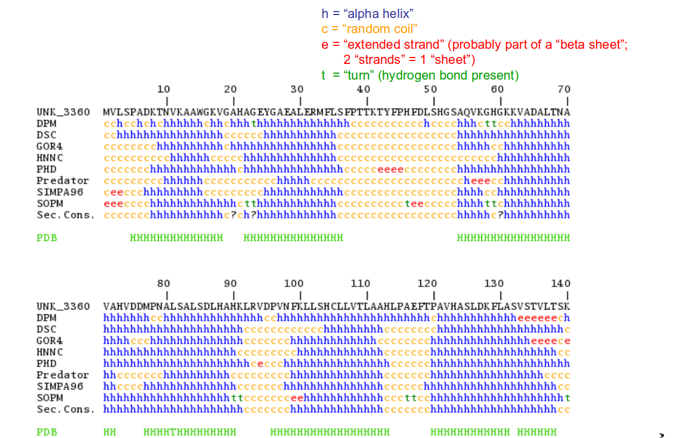

```{r,echo=FALSE}
## Set default options for the knitr RMD processing
knitr::opts_chunk$set(echo=FALSE,warning=FALSE,message=FALSE,fig.width=5,fig.height=5,cache=FALSE,autodep=TRUE, results="hide")
library(pander)
library(knitr)
library(kableExtra)
source("functions.R")
```

```{r echo=FALSE,include=FALSE,eval=TRUE}
options(crayon.enabled = TRUE)
options(crayon.colors = 256)
knitr::knit_hooks$set(output = function(x, options){
  paste0(
    '<pre class="r-output"><code>',
    fansi::sgr_to_html(x = htmltools::htmlEscape(x), warn = FALSE),
    '</code></pre>'
  )
})

## this is an ugly, ugly hack, but otherwise crayon does not LISTEN TO REASON!!!
num_colors <- function(forget=TRUE) 256
library(crayon)
assignInNamespace("num_colors", num_colors, pos="package:crayon")
```


```{r libraries,cache=FALSE}
library(tidyverse)
```


# Why do we need sequence similarity, phylogeny and structure prediction?

---

## We lack information!


*Huss et al. “The Gene Wiki: community intelligence applied to human gene
annotation”. 2010. Nucleic Acids Res. 38:D633-D639. doi:10.1093/nar/gkp760*

---

## We lack information and we will lack information

.pull-left[

]

.pull-right[
* top: literature
* bottom: grant funding
]

*Su and Hogenesch. “Power-law-like distributions in biomedical publications
and research funding”. 2007. Genome Biol. 8(4):404.  doi:10.1186/gb-2007-8-4-404*

---

## How bioinformatics can help

 * Evolutionary relationships allow to find orthologous proteins with
   conserved functions
    * we need phylogeny 
    * we need sequence similarity
 * Structural bioinformatics allows to predict protein structures and
   protein-protein interactions
    * we need structure prediction from sequences

In any case, we need to understand AA sequences!

---

## The genetic code ✪


```{r results="markdown"}
cod <- get_codon_table(n=1)
cdn <- get_codon_pivot(cod)

kable(cdn) %>% kable_styling(font_size=12, full_width=TRUE) %>%
	column_spec(2, color=ifelse(grepl("STP", cdn[[2]]), "#BB0000", "#000000")) %>%
	column_spec(3, color=ifelse(grepl("STP", cdn[[3]]), "#BB0000", "#000000")) %>%
	column_spec(4, color=ifelse(grepl("STP", cdn[[4]]), "#BB0000", "#000000")) %>%
	column_spec(5, color=ifelse(grepl("STP", cdn[[5]]), "#BB0000", "#000000")) %>%
	add_header_above(header=c("", "Second position in a codon"=4))
```


---

## The genetic code: variants ✪

```{r results="asis"}
output <- system2("gp_seq2prot", args="-l", stdout=TRUE) %>% { gsub("^[0-9 ]*", "", . ) }
cat("\n```\n")
cat(paste(output, collapse="\n"))
cat("\n```\n")
```


---

```{r}
n <- 4
```

## The genetic code: Protozoan mitochondrial, Mycoplasma

.pull-left[

```{r results="markdown"}
kable_print_codon_table(cdn)
```

`r output[1]`

]

.pull-right[

```{r results="markdown"}
cod2 <- get_codon_table(n=n)
cdn2 <- get_codon_pivot(cod2)
kable_print_codon_table(cdn2, compare=cdn)
```

`r output[n]`

]


---

```{r}
n <- 2
```


## The genetic code: `r output[n]`

.pull-left[

```{r results="markdown"}
kable_print_codon_table(cdn)
```

`r output[1]`

]

.pull-right[

```{r results="markdown"}
cod2 <- get_codon_table(n=n)
cdn2 <- get_codon_pivot(cod2)
kable_print_codon_table(cdn2, compare=cdn)
```

`r output[n]`

]

---

## Open reading frames ✪


```
A A T G G T G C T G T C T C C T G C C G A C A A G A C C A A C G T C A A G G T A  
```

--

```
A A T|G G T|G C T|G T C|T C C|T G C|C G A|C A A|G A C|C A A|C G T|C A A|G G T|A  
```

--

```
  N     
```


---

## Open reading frames


```
A A T G G T G C T G T C T C C T G C C G A C A A G A C C A A C G T C A A G G T A  
```

```
A A T|G G T|G C T|G T C|T C C|T G C|C G A|C A A|G A C|C A A|C G T|C A A|G G T|A  
```

```
  N     G     
```


---

## Open reading frames


```
A A T G G T G C T G T C T C C T G C C G A C A A G A C C A A C G T C A A G G T A  
```

```
A A T|G G T|G C T|G T C|T C C|T G C|C G A|C A A|G A C|C A A|C G T|C A A|G G T|A  
```

```
  N     G     A     V     S     C     R     Q     D     Q     R     Q     G   
```

--

```
A|A T G|G T G|C T G|T C T|C C T|G C C|G A C|A A G|A C C|A A C|G T C|A A G|G T A| 

```

--

```
    M     V     L     S     P     A     D     K     T     N     V     K     V   
```

--

```
A A|T G G|T G C|T G T|C T C|C T G|C C G|A C A|A G A|C C A|A C G|T C A|A G G|T A  
```

--

```
      W     C     C     L     L     P     T     R     P     T     S     R   
```

---

## Open reading frames: reverse complement

```
5'- A A T G G T G C T G T C T C C T G C C G A C A A G A C C A A C G T C A A G G T A -3'
```

--

```
3'- T T A C C A C G A C A G A G G A C G G C T G T T C T G G T T G C A G T T C C A T -5'
```

--
(in normal direction)

```
5'- T A C C T T G A C G T T G G T C T T G T C G G C A G G A G A C A G C A C C A T T -3'
```

--

```
      Y     L     D     V     G     L     V     G     R     R     Q     H     H   

        T     L     T     L     V     L     S     A     G     D     S     T     I   

          P     *     R     W     S     C     R     Q     E     T     A     P   
```


---
class:empty-slide,myinverse
background-image:url(images/aa_overview.png)


---

## AA properties ✪


---

## AA properties ✪


---

## AA properties ✪

Non-synonymous mutations (which change amino acids) can change the
structure and / or function of a protein.

They are more likely to change the function if the result is less similar:

```{r results="markdown"}
read.table(text="
TTT (Phe) 	Phenylalanine: a large, hydrophobic, aromatic AA
TTT (Phe) -> TTC (Ser)	a tiny, polar AA                             
TTT (Phe) -> TAC (Tyr)	another large, hydrophobic/polar, aromatic AA
GCT (Ala)	Alanine – small, alpha helix-forming AA
GCT (Ala) -> CTC (Leu)	very similar, also alpha helix forming
GCT (Ala) -> ACT (Thr)	threonine is beta-sheet forming       
GCT (Ala) -> CCT (Pro)	 proline is a helix breaker!          ",
sep="\t") %>% kable(col.names=NULL)
```

--

✪ Replacing an AA by a similar AA is less likely to lead to a loss of
function, therefore such substitutions happen more often in the course of
evolution.

---

## Aligning protein sequences

Basic idea: instead of using a score "match / mismatch", use a score which

 * reflects the similarity between amino acids, or
 * reflects the frequency of given substitutions during evolution

---


```{r, results="markdown"}
require(readxl)
im <- read_xlsx("data/aa_counts.xlsx")
rownames(im) <- colnames(im)
im <- t(im)
options(knitr.kable.NA="–")
out <- im %>% kable() %>% 
  kable_styling(font_size=12, full_width=TRUE) 
out
```

---

```{r, results="markdown"}
for(i in 1:ncol(im)) {
  out <- out %>%
    column_spec(i + 1, color=spec_color(-im[i,]),
      background=spec_color(im[i,]))
}
out
```


---

.pull-left[
```{r, results="markdown"}
out <- im %>% kable() %>% 
  kable_styling(font_size=7, full_width=TRUE) 
for(i in 1:ncol(im)) {
  out <- out %>%
    column_spec(i + 1, color=spec_color(-im[i,]),
      background=spec_color(im[i,]))
}
out
```
]

.pull-right[


]


---

## The problem: multiple substitutions ✪

This makes sense when you think of *one* mutation only. 

```
A -> V
```

--

However, in the millions of years of evolution each amino acid has multiple
"chances" to be mutated, so there is a chain of substitutions. Say, in one
species we find at a given site a leucine. This might have happened, with
the ancestral sequence having alanine:

```
A -> V -> I -> M -> L
```

--

Moreover, this chain (Markov chain!) occurs independently in another species:

```
   -> V -> I -> M -> L
 /
A
 \
   -> S -> T
```

However, we only see the mismatch `T <-> L`.

--

Long evolutionary time means that the observed mutation frequencies will
change

---

## Margaret Dayhoff

.pull-left[


]

.pull-right[

Margaret Dayhoff (1925-1983)

 * Pioneer of bioinformatics
 * Started by calculating resonance energies of polycyclic organic
   molecules using a punch-card computer
 * First computer program to predict protein structure (together with
   Robert Ledley)
 * Worked with Carl Sagan on planetary prebiotic atmospheric models
 * Pioneered molecular phylogeny methods
 * Developed the PAM matrices for protein sequence comparison
 * Worked for years on IBM 7094 (100 Kflops/s! for comparison: a graphic
   card may have several teraflops)


]

---

## PAM matrices ✪

PAM - point accepted mutations

Basic idea: estimate the mutation frequency from closely related sequences,
then use a Markov-chain model to estimate the expected frequencies of
mutations for longer evolutionary times.

---

## Constructing the mutation matrix $M_1$

We assume that for closely related sequences, at most one mutation may have
occured. We calculate the entries in the $PAM_1$ matrix simply by looking
at the frequencies of $AA_i \leftrightarrow AA_j$ substitutions (mismatches
in an alignment).

$$M_1(i, j) = \lambda \frac{A(i, j)}{N\cdot f(j)}$$

Where $i$, $j$ are amino acids, $A(i, j)$ is the number of occurences of
mismatches of $i$ with $j$ amino acids, $N$ is the number of amino acids
and $f(j)$ is the frequency of amino acid $j$.


---

## Constructing PAM matrices for longer evolutionary times

Using a Markov chain model of AA substitutions:

$$M_n = M_1^n$$

```{r results="markdown"}
read.table(text="
PAM	Sequence identity
PAM1	99%
PAM30	75%
PAM80	50%
PAM200	25%", header=TRUE, sep="\t") %>% kable()
```

---

.pull-left[

PAM10 (similar sequences)

```{r results="markdown"}
pam <- read.table("data/PAM10", comment.char="#") 
pam <- pam[1:20, 1:20]
out <- pam %>% kable() %>%
  kable_styling(font_size=7, full_width=TRUE) 
for(i in 1:ncol(pam)) {
  out <- out %>%
    column_spec(i + 1, color=ifelse(pam[,i] > 0, "black", "white"),
      background=spec_color(pam[,i]))
}
out
```

]

.pull-right[

PAM400 (distant sequences)

```{r results="markdown"}
pam <- read.table("data/PAM400", comment.char="#") 
pam <- pam[1:20, 1:20]
out <- pam %>% kable() %>%
  kable_styling(font_size=7, full_width=TRUE) 
for(i in 1:ncol(pam)) {
  out <- out %>%
    column_spec(i + 1, color=ifelse(pam[,i] > 0, "black", "white"),
      background=spec_color(pam[,i]))
}
out
```

]


---

## BLOSUM matrices ✪

Idea: instead of extrapolating, use different sets of sequences with
different average similarity (50%, 60%, 90%, 99%).

For each set, calculate scores as log-odds ratios

$$S_{i,j}=\frac{1}{\lambda}\frac{f_O(i,j)}{f_E(i,j)}=\frac{1}{\lambda}\log\frac{p_{i,j}}{q_{i} q_{j}}$$

Where $f_O$ is the observed frequency, $f_E$ is the expected frequency
(based on frequencies of both amino acids), $p_{i,j}$ is the number of
observed mismatches, $q_{i}$ and $q_{j}$ are the observed frequencies of
the amino acids (independent of each other).

--

So if there were 20 $A \leftrightarrow L$ mismatches out of 1000 observed
mismatches, and $A$ frequency was $0.01$, $L$ frequency was $0.005$, then
$f_O = p_{L,A} = \frac{20}{1000} = 0.02$ and

$$\frac{f_O}{f_E}=\frac{0.02}{0.01 \cdot 0.005} = 400$$

$$\log\frac{f_O}{f_E} = 6$$

---

.pull-left[
```
                🠗
                WLL
                WLI
                WIL
                WIL
                YIW
                YIL
```
]

.pull-right[
Number of pairs in the first column:

$$c_{i,i} = \frac{N(N-1)}{2}$$

$$c_{i,j} = n_i \cdot n_j$$

```
W-W: 6
Y-Y: 1
W-Y: 8
```
]

---

.pull-left[
```
                 🠗
                WLL
                WLI
                WIL
                WIL
                YIW
                YIL
```
]

.pull-right[
Number of pairs in the second column:

```
L-L: 1
I-I: 6
L-I: 8
```
]

---

.pull-left[
```
                  🠗
                WLL
                WLI
                WIL
                WIL
                YIW
                YIL
```
]

.pull-right[
Number of pairs in the third column:

```
L-L: 6
I-I: 0
L-W: 4
L-I: 4
I-W: 1
```
]

---

.pull-left[
```
                  
                WLL
                WLI
                WIL
                WIL
                YIW
                YIL
```
]

.pull-right[
Number of pairs in all columns:

```
W-W: 6
Y-Y: 1
W-Y: 8
L-L: 7
L-W: 4
L-I: 12
I-I: 6
I-W: 1
```
]


---

.pull-left[
```
                  
                WLL
                WLI
                WIL
                WIL
                YIW
                YIL
```
]

.pull-right[
Number of pairs in all columns:

```
    I    L    W    Y
I   6    12   1    ?
L        7    4    ?
W             6    8
Y                  1
```
]


---

.pull-left[
```
                  
                WLL
                WLI
                WIL
                WIL
                YIW
                YIL
```
]

.pull-right[
To get frequencies, divide by total number of pairs:

$$N_c \cdot \frac{N_s\cdot(N_s - 1)}{2} = 3 \cdot \frac{6\cdot 5}{2} = 45$$

Matrix of observed frequencies, $f_O$

```
    I      L       W      Y
I 0.133  0.267   0.022 ?
L        0.156   0.089 ?
W                0.133 0.178
Y                      0.022
```


]

---

.pull-left[
```
                  
                WLL
                WLI
                WIL
                WIL
                YIW
                YIL
```
]

.pull-right[
To get expected frequencies, we need to calculate the frequencies of amino acids

```
f(W) = (4+1)/(3 * 6) = 5/18 = 0.28
f(Y) = 2/18 = 0.11
p(W, W) = f(W) * f(W) = 0.28^2 = 0.08
p(Y, W) = 2 * f(W) * f(Y) = 2 * 0.28 * 0.11 = 0.062
```

etc.

]


---

.pull-left[
```
                  
                WLL
                WLI
                WIL
                WIL
                YIW
                YIL
```
]

.pull-right[
To get expected frequencies, we need to calculate the frequencies of amino acids

```
f(W) = (4+1)/(3 * 6) = 5/18 = 0.28
f(Y) = 2/18 = 0.11
p(W, W) = f(W) * f(W) = 0.28^2 = 0.08
p(Y, W) = 2 * f(W) * f(Y) = 2 * 0.28 * 0.11 = 0.062
```


```
    I      L       W      Y
I 0.077  0.186   0.155 0.062
L        0.112   0.186 0.074
W                0.077 0.062
Y                      0.012
```

etc.

]

---

Now we have to divide one matrix by another
and logarithmize them

.pull-left[
Observed frequencies:
```
    I      L       W      Y
I 0.133  0.267   0.022 ?
L        0.156   0.089 ?
W                0.133 0.178
Y                      0.022
```
]

.pull-right[
Expected frequencies:
```
    I      L       W      Y
I 0.077  0.186   0.155 0.062
L        0.112   0.186 0.074
W                0.077 0.062
Y                      0.012
```
]

e.g.

$$\log\frac{f_O(W, Y)}{f_E(W, Y)} = \log\frac{0.178}{0.062} = 1.05$$

---

Now we have to divide one matrix by another
and logarithmize them

.pull-left[
Observed frequencies:
```
    I      L       W      Y
I 0.133  0.267   0.022 ?
L        0.156   0.089 ?
W                0.133 0.178
Y                      0.022
```

Result:

```
    I      L       W      Y
I 0.55   0.36    -1.95    ?
L        0.33    -0.74    ?
W                0.55   1.05
Y                       0.61
```

]

.pull-right[
Expected frequencies:
```
    I      L       W      Y
I 0.077  0.186   0.155 0.062
L        0.112   0.186 0.074
W                0.077 0.062
Y                      0.012
```
]

---

To get the scores, we multiply by 10 and round the numbers


.pull-left[
Observed frequencies:
```
    I      L       W      Y
I 0.133  0.267   0.022 ?
L        0.156   0.089 ?
W                0.133 0.178
Y                      0.022
```

Result:

```
    I      L       W      Y
I 0.55   0.36    -1.95    ?
L        0.33    -0.74    ?
W                0.55   1.05
Y                       0.61
```

]

.pull-right[
Expected frequencies:
```
    I      L       W      Y
I 0.077  0.186   0.155 0.062
L        0.112   0.186 0.074
W                0.077 0.062
Y                      0.012
```

After rounding:

```
    I      L       W      Y
I   6      4      -20     ?
L          3       -7     ?
W                   6    11
Y                         6
```

]

---

To get the scores, we multiply by 10 and round the numbers


.pull-left[
Our matrix:

```
    I      L       W      Y
I   6      4      -20     ?
L          3       -7     ?
W                   6    11
Y                         6
```


]

.pull-right[

Real BLOSUM62:

```
    I      L       W      Y
I   4      2       -3    -1
L          3       -2    -1
W                  11     2
Y                         7
```
]


---


.pull-left[

BLOSUM100 (very similar sequences, almost 100%)

```{r results="markdown"}
pam <- read.table("data/BLOSUM100", comment.char="#") 
pam <- pam[1:20, 1:20]
out <- pam %>% kable() %>%
  kable_styling(font_size=7, full_width=TRUE) 
for(i in 1:ncol(pam)) {
  out <- out %>%
    column_spec(i + 1, color=ifelse(pam[,i] > 0, "black", "white"),
      background=spec_color(pam[,i], scale_from=c(-10, 20)))
}
out
```

]

.pull-right[

BLOSUM35 (distant sequences)

```{r results="markdown"}
pam <- read.table("data/BLOSUM30", comment.char="#") 
pam <- pam[1:20, 1:20]
out <- pam %>% kable() %>%
  kable_styling(font_size=7, full_width=TRUE) 
for(i in 1:ncol(pam)) {
  out <- out %>%
    column_spec(i + 1, color=ifelse(pam[,i] > 0, "black", "white"),
      background=spec_color(pam[,i], scale_from=c(-10, 20)))
}
out
```

]


---

## Alpha helices and beta sheets

.pull-left[

Alpha helices:


A leucine zipper

]

.pull-right[

Beta sheets:


Beta sheets in a barrel fold

]


---

## Protein structures ✪

.pull-left[

]


.pull-right[

Predicting secondary structures (alpha helices / beta sheets) is easier
than predicting the tertiary structure.

]

---

## Sequence prediction ✪


*Torrisi, Mirko, Gianluca Pollastri, and Quan Le. "Deep learning methods in
protein structure prediction." Computational and Structural Biotechnology
Journal (2020).*


---

## Secondary structures

Helix-forming amino acids: "MALEK" (methionine, alanine, leucine,
glutamate, uncharged lysine)

Beta-sheet forming amino acids: large aromatic, or branching: tyrosine,
phenylalanine, tryptophan, threonine, valine, isoleucine


---

## Chou-Fasman algorithm

 * Assign a "potential" score to each amino acid based on known structures
   (15 at the time): 
   * separately potential for forming alpha-helices and beta-sheets
   * scores are log-odds plus 1 (so 0 means that observed frequency is
     equal to expected frequency)
 * For a given structure (a-helix or b-sheet):
    * Find "seed" regions where there are several of high scoring residues
    * Try to extend the region in both direction, as long as the number of
      high scoring residues does not fall below a threshold


---

.pull-left[

```{r results="markdown"}
cf <- read_tsv("data/choufasman.txt")

tbl <- cbind(
  cf %>% select(Abbr, Name, all_of("P(a)")) %>% arrange(-.data[["P(a)"]]) %>%
		mutate("A?"=
			cut(.data[["P(a)"]], c(-Inf, .6, .99, 1.05, 1.2, Inf), labels=c("-A", "-a", "0", "+a", "+A"))),
  cf %>% select(Abbr, Name, all_of("P(b)")) %>% arrange(-.data[["P(b)"]]) %>%
		mutate("B?"=
			cut(.data[["P(b)"]], c(-Inf, .6, .8, 1, 1.4, Inf), labels=c("-B", "-b", "0", "+b", "+B")))
)

tbl %>% kable() %>% kable_styling(font_size=12)

```

]

.pull-right[


]


---

Given this sequence...

```

 Gly– His – Glu – Val - Glu – Ala – Glu – Gly – Val – Tyr – Val – Tyr –Gly


```

---

Assign alpha-helix scores from the table

```


 Gly– His – Glu – Val - Glu – Ala – Glu – Gly – Val – Tyr – Val – Tyr –Gly

 0.57 1.00  1.51  1.06  1.51  1.42  1.51  0.57  1.06  0.69  1.06  0.69 0.57


```


---

(we show the alpha-helix forming property)

```


 Gly– His – Glu – Val - Glu – Ala – Glu – Gly – Val – Tyr – Val – Tyr –Gly

 0.57 1.00  1.51  1.06  1.51  1.42  1.51  0.57  1.06  0.69  1.06  0.69 0.57
 -A    0     +A    +a    +A    +A    +A    -A    +a    -a    +a    -a   -A


```


---

Find a nucleation site where 5/6 are a+ or A+

```
 [---  nucleation site  --------]

 Gly– His – Glu – Val - Glu – Ala – Glu – Gly – Val – Tyr – Val – Tyr –Gly

 0.57 1.00  1.51  1.06  1.51  1.42  1.51  0.57  1.06  0.69  1.06  0.69 0.57
 -A    0     +A    +a    +A    +A    +A    -A    +a    -a    +a    -a   -A
  H     H     H     H     H     H     


```

Nucleation site gets to be a helix.

---

Use a sliding window to extend the helix. Abort if score falls below 1.03

```
 [---  nucleation site  --------]
                  [--- window of 4 -->]
 Gly– His – Glu – Val - Glu – Ala – Glu – Gly – Val – Tyr – Val – Tyr –Gly

 0.57 1.00  1.51  1.06  1.51  1.42  1.51  0.57  1.06  0.69  1.06  0.69 0.57
 -A    0     +A    +a    +A    +A    +A    -A    +a    -a    +a    -a   -A
  H     H     H     H     H     H     H


```

Score: `(1.06 + 1.51 + 1.42 + 1.51)/4 = 1.38 > 1.03`

---

Extend...

```
 [---  nucleation site  --------]
                        [--- window of 4 -->]
 Gly– His – Glu – Val - Glu – Ala – Glu – Gly – Val – Tyr – Val – Tyr –Gly

 0.57 1.00  1.51  1.06  1.51  1.42  1.51  0.57  1.06  0.69  1.06  0.69 0.57
 -A    0     +A    +a    +A    +A    +A    -A    +a    -a    +a    -a   -A
  H     H     H     H     H     H     H     H     


```

Score: `(1.51 + 1.42 + 1.51 + 0.57 )/4 = 1.25 > 1.03`

---

Extend...

```
 [---  nucleation site  --------]
                              [--- window of 4 -->]
 Gly– His – Glu – Val - Glu – Ala – Glu – Gly – Val – Tyr – Val – Tyr –Gly

 0.57 1.00  1.51  1.06  1.51  1.42  1.51  0.57  1.06  0.69  1.06  0.69 0.57
 -A    0     +A    +a    +A    +A    +A    -A    +a    -a    +a    -a   -A
  H     H     H     H     H     H     H     H     H


```

Score: `(1.42 + 1.51 + 0.57 + 1.06)/4 = 1.14 > 1.03`

---

Abort when the score drops off.

```
 [---  nucleation site  --------]
                                    [--- window of 4 -->]
 Gly– His – Glu – Val - Glu – Ala – Glu – Gly – Val – Tyr – Val – Tyr –Gly

 0.57 1.00  1.51  1.06  1.51  1.42  1.51  0.57  1.06  0.69  1.06  0.69 0.57
 -A    0     +A    +a    +A    +A    +A    -A    +a    -a    +a    -a   -A
  H     H     H     H     H     H     H     H     H


```

Score: `(1.51 + 0.57 + 1.06 + 0.69 )/4 = 0.96 < 1.03` $\rightarrow$ ABORT!

---

Now, the same for amino acids: nucleation = 3 out of 5 are +b/+B

```
                                                 [-- nucleation site ----]

 Gly– His – Glu – Val - Glu – Ala – Glu – Gly – Val – Tyr – Val – Tyr –Gly


 0.75 0.87  0.37  1.70  0.37  0.83  0.37  0.75  1.70  1.47  1.70  1.47 0.75
 -b    0     -B    +B    -B     0    -B    -b    +B    +B    +B    +B   -b
                                                  E     E     E     E    E
```


---

Sliding window goes in both directions.

```
                                                 [-- nucleation site ----]
                                          [<- window ---------]
 Gly– His – Glu – Val - Glu – Ala – Glu – Gly – Val – Tyr – Val – Tyr –Gly


 0.75 0.87  0.37  1.70  0.37  0.83  0.37  0.75  1.70  1.47  1.70  1.47 0.75
 -b    0     -B    +B    -B     0    -B    -b    +B    +B    +B    +B   -b
                                            E     E     E     E     E    E
```


---

Extend...

```
                                                 [-- nucleation site ----]
                                    [<- window ---------]
 Gly– His – Glu – Val - Glu – Ala – Glu – Gly – Val – Tyr – Val – Tyr –Gly


 0.75 0.87  0.37  1.70  0.37  0.83  0.37  0.75  1.70  1.47  1.70  1.47 0.75
 -b    0     -B    +B    -B     0    -B    -b    +B    +B    +B    +B   -b
                                      E     E     E     E     E     E    E
```


---

Abort!

```
                                                 [-- nucleation site ----]
                              [<- window ---------]
 Gly– His – Glu – Val - Glu – Ala – Glu – Gly – Val – Tyr – Val – Tyr –Gly


 0.75 0.87  0.37  1.70  0.37  0.83  0.37  0.75  1.70  1.47  1.70  1.47 0.75
 -b    0     -B    +B    -B     0    -B    -b    +B    +B    +B    +B   -b
                                      E     E     E     E     E     E    E
```

Score: `(0.83 + 0.37 + 0.75 + 1.70)/4 = 0.91 < 1.0`

(threshold for beta helices: 1.0)

---

Conflicts resolved by higher average

```


 Gly– His – Glu – Val - Glu – Ala – Glu – Gly – Val – Tyr – Val – Tyr –Gly

 0.57 1.00  1.51  1.06  1.51  1.42  1.51  0.57  1.06  0.69  1.06  0.69 0.57
 -A    0     +A    +a    +A    +A    +A    -A    +a    -a    +a    -a   -A
  H     H     H     H     H     H     H     H     H
 0.75 0.87  0.37  1.70  0.37  0.83  0.37  0.75  1.70  1.47  1.70  1.47 0.75
 -b    0     -B    +B    -B     0    -B    -b    +B    +B    +B    +B   -b
                                      E     E     E     E     E     E    E
```


Average for a-helices: `(1.51 + 0.57 + 1.06 )/3 = 1.05`

Average for b-sheets:  `(0.37 + 0.75 + 1.70 )/3 = 0.94`


---

Choose H over E (because of averages)

```


 Gly– His – Glu – Val - Glu – Ala – Glu – Gly – Val – Tyr – Val – Tyr –Gly

 0.57 1.00  1.51  1.06  1.51  1.42  1.51  0.57  1.06  0.69  1.06  0.69 0.57
 -A    0     +A    +a    +A    +A    +A    -A    +a    -a    +a    -a   -A
  H     H     H     H     H     H     H     H     H
 0.75 0.87  0.37  1.70  0.37  0.83  0.37  0.75  1.70  1.47  1.70  1.47 0.75
 -b    0     -B    +B    -B     0    -B    -b    +B    +B    +B    +B   -b
                                      X     X     X     E     E     E    E
```

---

Final result

```


 Gly– His – Glu – Val - Glu – Ala – Glu – Gly – Val – Tyr – Val – Tyr –Gly

  H     H     H     H     H     H     H     H     H    E     E     E    E
```

---
class:empty-slide,myinverse
background-image:url(images/quokka.png)


---



---

## Sequence structure gap


It appears that structural information grows linearly, while amount of
sequence information grows exponentially.

*Torrisi, Mirko, Gianluca Pollastri, and Quan Le. "Deep learning methods in
protein structure prediction." Computational and Structural Biotechnology
Journal (2020).*


---

## Improvements in structure prediction


(2D structure prediction)

"stat" are statistical models (like Chou-Fasman)


