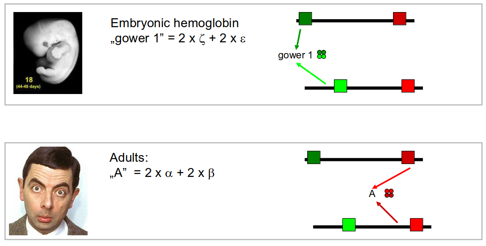
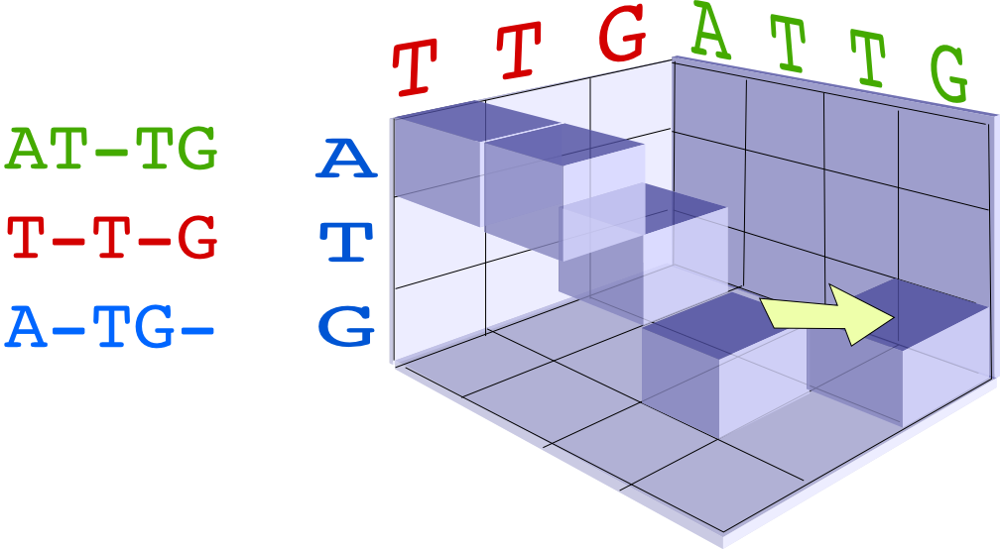
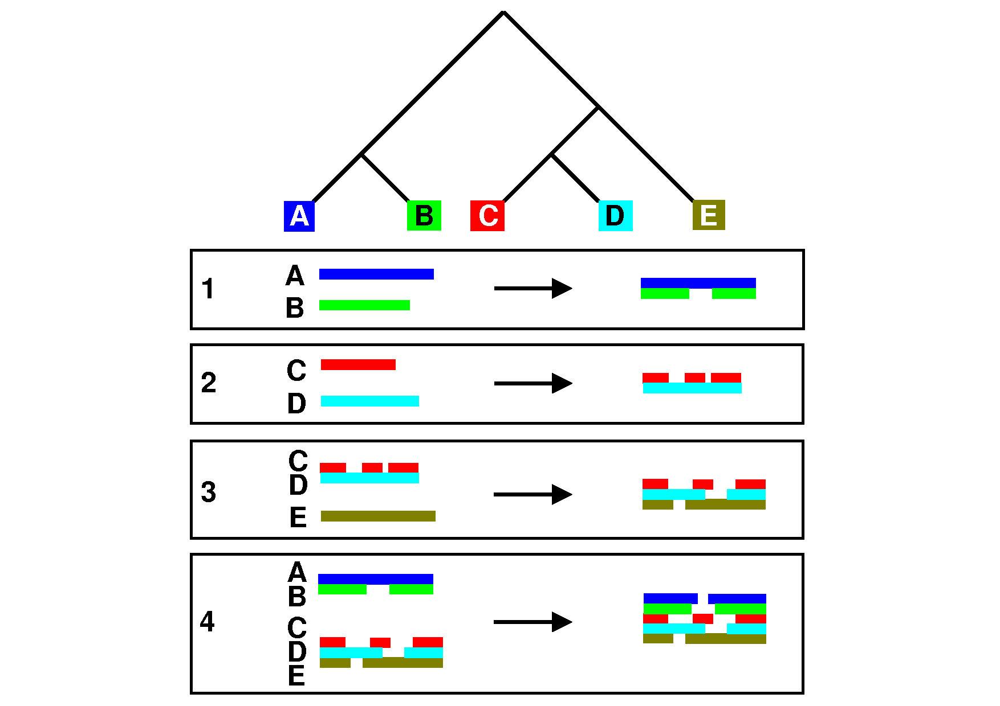
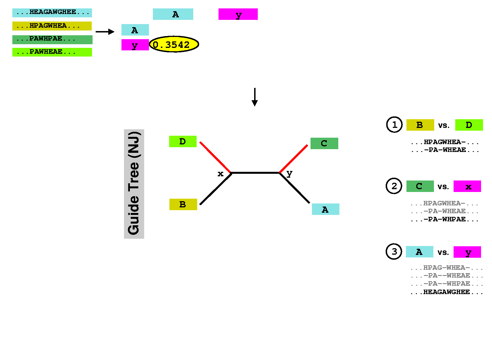
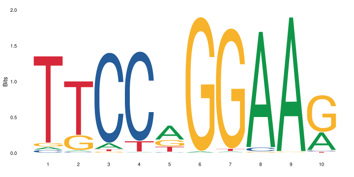
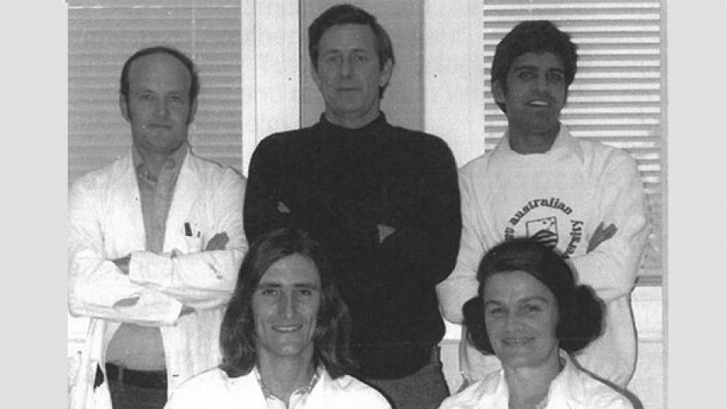
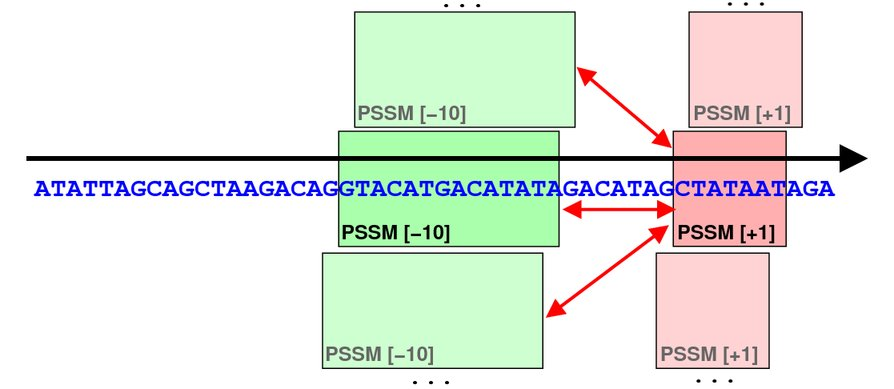

```{r,echo=FALSE}
## Set default options for the knitr RMD processing
knitr::opts_chunk$set(echo=FALSE,warning=FALSE,message=FALSE,fig.width=5,fig.height=5,cache=FALSE,autodep=TRUE, results="hide")
library(pander)
library(knitr)
library(kableExtra)
source("functions.R")
```

```{r echo=FALSE,include=FALSE,eval=TRUE}
options(crayon.enabled = TRUE)
options(crayon.colors = 256)
knitr::knit_hooks$set(output = function(x, options){
  paste0(
    '<pre class="r-output"><code>',
    fansi::sgr_to_html(x = htmltools::htmlEscape(x), warn = FALSE),
    '</code></pre>'
  )
})

## this is an ugly, ugly hack, but otherwise crayon does not LISTEN TO REASON!!!
num_colors <- function(forget=TRUE) 256
library(crayon)
assignInNamespace("num_colors", num_colors, pos="package:crayon")
```


```{r libraries,cache=FALSE}
library(tidyverse)
```


class:empty-slide,myinverse
background-image:url(images/mark_boguski.jpg)


---
class:empty-slide,myinverse
background-image:url(images/crichton_letter.png)


---

## Sequence conservation & logos


---

## What are these bits??

Visualize uncertainty (defined as Shannon entropy) about a given position
using *information bits*.

Entropy at position $i$ describes the probability with which we can predict
the outcome:

$H_i = - \sum_{aa=1}^{20} f_{aa,i} \cdot \log_2 f_{aa,i}$

--

For example, if at a certain position we have 100 % Ala and 0 % of other amino acids,

$H_i = -f_{Ala,i}\cdot \log_2 f_{Ala,i} + \sum_{aa \neq Ala} f_{aa,i}\log_2 f_{aa, i} = - 1 \cdot \log_2 1 + 0 = 0$

--

But if Ala and His are at equal frequencies, we get

$H_i = -0.5 \log_2 0.5 - 0.5 \log_2 0.5 = - 0.5 \cdot -1 - 0.5 \cdot -1 = 1$

--

And if all amino acids are at the same frequencies, we have

$H_i = -20 \cdot 0.05 \cdot \log_2 0.05 \approx -20 \cdot 0.05 \cdot -4.3 = 4.3$

---

## What are these bits??

Bits are now defined as

$R_i = \log_2 20 - H_i + e_n \approx 4.3 - H_i$

(where $e_n$ is correction for small sample sizes (reduces to zero for
large number of sequences)

--

So for all frequencies equal, $H_i \approx 4.3$ and $R_i \approx 0$; for
one frequency equal to 100%, $H_i = 0$ and $R_i \approx 4.3$.

--

This gives a scaling factor for the height of the letters:

$bits = y_{aa,i} = f_{aa,i} \cdot R_i$

---


---

## Our many hemoglobins...


---

## Our many hemoglobins...


So, why do we need so many?

$\rightarrow$ example of subfunctionalization

---

## Zeta hemoglobin function

.pull-left[

]

.pull-right[

]

---

## Zeta hemoglobin function




---

## Zeta hemoglobin function


---

## Multiple sequence alignments


---

## Multiple sequence alignments

What is it good for?


---

## Multiple sequence alignments


 * Find groups of sequences
 * Determine conserved regions
   * Conserved region: important! $\rightarrow$ purifying selection
 * Find motifs and domains
 * Find common physical properties
   * Do changes in amino acids cause changes in physical properties?
 * Create profiles / HMM models for sensitive homology search
 * First step to phylogeny reconstruction


---

The alignment clearly shows the two paralogs of hemoglobin (A and B)


---

Alignment showing physical properties of amino acids


---

We can find conserved regions / protein domains


---

## How to score a multiple alignment

Add scores from all possible pairs of sequences

Score for a column $i$ in a multiple sequence alignment:

$$S_i = \sum_{j=1}^{N} \sum_{k=j + 1}^{N} aa_{i,j,k}$$

Score for the full alignment:

$$S = \sum_{i=1}^L \sum_{j=1}^{N} \sum_{k=j + 1}^{N} aa_{i,j,k}$$

where $L$ is the length of the alignment, $N$ is the number of sequences,
and $aa_{i,j,k}$ denotes scores between sequences $j$ and $k$ in column
$i$.

---

## Extending NW approach


---

## Extending NW approach


---

## Extending NW approach


---

## Extending NW approach


---

## Extending NW approach


---

## Extending NW approach



---

## Extending NW approach

 * complexity grows with each sequence in MSA
 * for 3 sequences, $O(n^3)$; for 4, $O(n^4)$, etc. $\rightarrow O(n^k)$
 * naive application completely useless
 * sped up with Carillo-Lipman approach, but still not scalable
 * not realistic for more than 4 sequences
 

---

## Heuristic 

 * compromise accuracy vs speed
 * algorithms:
   * progressive algorithms
      * clustal[o,w] $O(N^2)$ (clustalw), $O(N\log{N})$ (clustalo)
      * kalign
   * stepwise improvement / genetic
      * MUSCLE $O(N^3L)$

---

## ClustalW progressive algorithm

.pull-left[

]

.pull-right[
 * Calculate pairwise similarity (distance) between each two sequences
 * Build a similarity matrix
 * Create a "guide tree" (which sequences are next to each other?)
 * Step-wise assembly along the tree
]


---

## ClustalW algorithm


---

## ClustalW algorithm


---

## ClustalW algorithm


---

## ClustalW algorithm



---

## DNA/RNA sequence motifs

Protein binding motifs – binding transcription factors etc.



STAT3 – member of the JAK/STAT pathway


BATF::JUN heterodimer

---

## DNA/RNA sequence motifs

 Examples:
 
 * Shine-Dalgarno sequence 5'-AGGAGGU-3' in the untranslated region of mRNA, complementary to a sequence in the 16S
   rRNA, 5'-ACCUCCU-3':
 
.pull-left[
 
 ]

.pull-right[
 
 ]


.pull-left[

 * Kozak sequence in eukaryotes (detected by scanning throught the PIC,
   pre-initiation complex.

 
 ]

.pull-right[
 
 ]

---

## Position specific scoring matrices (PSSMs)

Creating a BLOSUM-like scoring system which depends on the *position* to
detect motifs.


---

## Position specific scoring matrices (PSSMs)

  * regulators
  * AT-rich upstream region
  * -35 box
  * -10 box (Pribnow box)
  * +1 / ATG

---

## Pribnow box (-10 box)


 * Not all promoters have the same sequence
 * Small differences follow a statistical distribution


---

Battle plan:

For each of the three main regions (-35, -10 and +1) create small
alignments.

--

In an alignment, count the frequencies of the four nucleotides at each
position and calculate scores as log-odds ratios


$$S_{nn,i} = \log\frac{f_{o,i}}{f_e}$$

Where $f_e$ is the expected frequency of nucletide $nn$ (given by the GC contents),
$f_{o,i}$ is the observed frequency at position $i$, and $S_{nn,i}$ is the
position-specific score.

--

Then, slide the three matrices along a DNA sequence and find the
position(s), where the overall score is maximal (we add the scores of the
three matrices together).

---


---


---


---


---


---


---


---


---


---




---


---


---


---


---


---


---


---


__

class:empty-slide,myinverse
background-image:url(images/cute_puppy.jpg)

