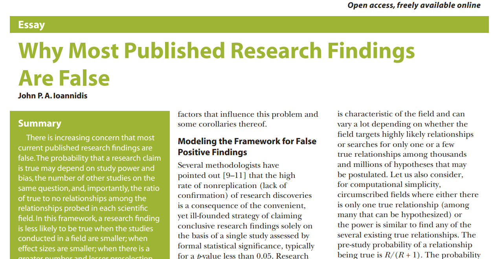
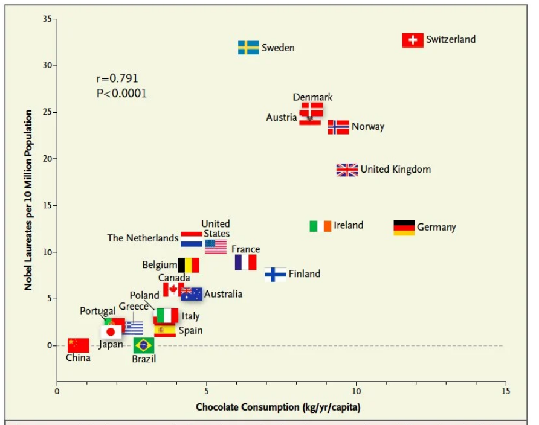
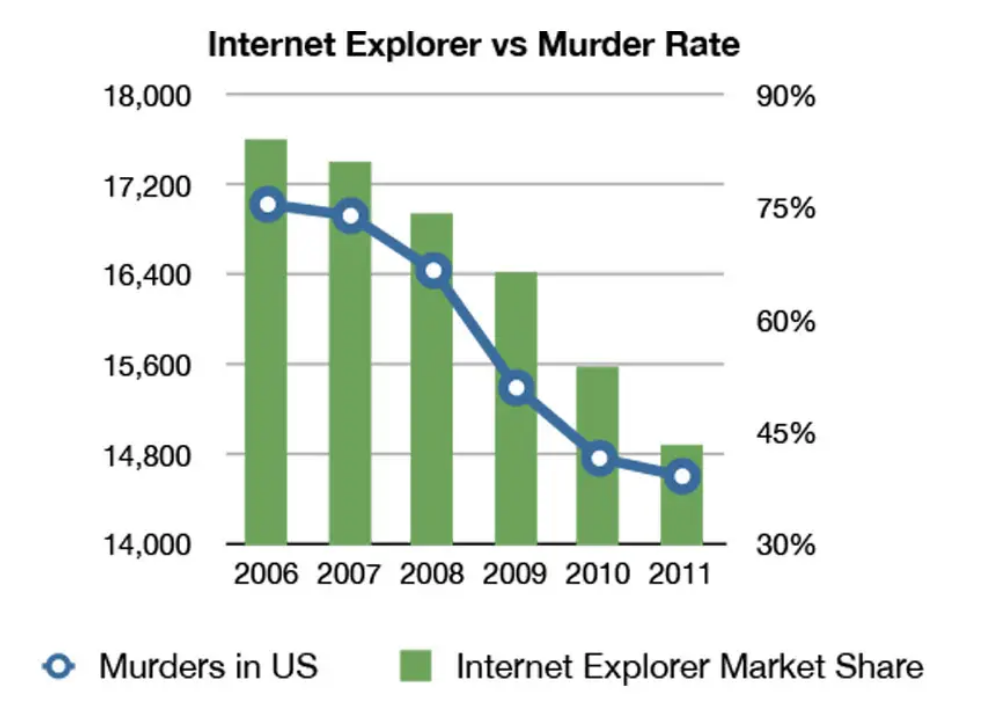

```{r,echo=FALSE}
## Set default options for the knitr RMD processing
knitr::opts_chunk$set(echo=FALSE,warning=FALSE,message=FALSE,fig.width=5,fig.height=5,cache=FALSE,autodep=TRUE, results="hide")
library(pander)
library(knitr)
library(kableExtra)
source("functions.R")
```

```{r echo=FALSE,include=FALSE,eval=TRUE}
options(crayon.enabled = TRUE)
options(crayon.colors = 256)
knitr::knit_hooks$set(output = function(x, options){
  paste0(
    '<pre class="r-output"><code>',
    fansi::sgr_to_html(x = htmltools::htmlEscape(x), warn = FALSE),
    '</code></pre>'
  )
})

## this is an ugly, ugly hack, but otherwise crayon does not LISTEN TO REASON!!!
num_colors <- function(forget=TRUE) 256
library(crayon)
assignInNamespace("num_colors", num_colors, pos="package:crayon")
```


```{r libraries,cache=FALSE}
library(tidyverse)
```

## Reproducibility crisis in science ✪

---

## Reproducibility crisis in science


*Open Science Collaboration. "Estimating the reproducibility of
psychological science." Science 349.6251 (2015).*

---

## Reproducibility crisis in science


*Perrin, Steve. "Preclinical research: Make mouse studies work." Nature
News 507.7493 (2014): 423.*

---

## Reproducibility crisis in science



---

## Reproducibility crisis in science

```{r results="markdown"}
require(tidyverse)
df <- read.delim(text='
"Journal impact factor"\tNumber of articles\tMean number of citations of non-reproduced articles*\tMean number of citations of reproduced articles
>20\t21\t248 (range 3–800)\t231 (range 82–519)
5–19\t32\t169 (range 6–1,909)\t13 (range 3–24)', sep="\t")
colnames(df) <- gsub("\\.", " ", colnames(df))
knitr::kable(df)
```

Bottom line: non-reproducible papers are more highly cited!

---

## Reasons for the reproducibility crisis: Money

.center[

]

---

## Reasons for the reproducibility crisis: Hype


---

## Reasons for the reproducibility crisis: Statistics


.center[


]


---

## Reasons for the reproducibility crisis: Lack of transparcency

 * no access to primary data
 * no precise description of methods:

```
We used generalized linear models (R package nlme4) to test the
significance of association.
```

Fine, but how exactly was the model formulated? How many covariates? What
transformations? What data were used? Which function? Were the results
corrected for multiple testing? Etc., etc., etc.

---

## Lack of transparency results in different results!


---

## Hypothesis testing in science


---

## Hypothesis testing in science ✪

 * Both $H_0$ and $H_1$ make certain assumptions like normality. The only
   difference is in the effect; usually, $H_0$ assumes no effect, $H_1$
   assumes that there is an (unknown) effect
 * The reason why we use p-values calculated based on $H_0$ is *that they
   are easy to calculate analytically* (i.e., without a computer).

---
class:empty-slide,myinverse
background-image:url(images/pregnant.jpg)

---

## What are p-values 

...imagine we toss a coin...


---

## What are p-values

Meaning of probability is different in classical (frequentist) statistics
and in bayesian statistics

     * in frequentist statistics, this is the probability of getting a
       similar or better result assuming the $H_0$. $\Rightarrow$ a coin
       that has landed is an event that happened, therefore p=1 OR p=0, but
       not p=0.5
     * in bayesian statistics, it is a measure of information (much as our
       intuition tells us!) $\Rightarrow$ as long as we don't know how the
       coin landed, we can use p=0.5


---

## What are p-values 

p-values are defined within frequentist hypothesis testing.

P-value gives us the average FPR (false positive rate, type I error rate)
if we do many experiments, assuming the $H_0$ ("no effect").

---


---

## p = 0.05

 * Arbitrary threshold introduced (mostly) by R.A. Fisher
 * In perfect circumstances, guarantees a false positive rate of 1 in 20

```
Q: Why do so many colleges and grad schools teach p = 0.05?

A: Because that's still what the scientific community and journal editors use.

Q: Why do so many people still use p = 0.05?

A: Because that's what they were taught in college or grad school.
```

*Wasserstein, Ronald L., and Nicole A. Lazar. "The ASA's statement on p-values: context, process, and purpose." The American Statistician (2016).*

---

## Is p = 0.05 enough?

Consider a test for a disease (like a test for Sars-Cov-2 infection). 

 * Sensitivity 80%: that is, no more than 20% False Negatives (FNs)
 * Specificity 95%: no more than 5% False Positives (FPs)

Imagine you are tested and that the result is positive. What is the
probability that you are infected with Sars-Cov-2?


(**Note:** in reality, the Sars-Cov-2 tests are *much* more sensitive and
specific)

---

## Is p = 0.05 enough?


---

## Is p = 0.05 enough?


---

## Is p = 0.05 enough?


---

## Is p = 0.05 enough?

OK, now replace "Sars-Cov-2 test" with "hypothesis test".

 * 80% sensitivity is normal for statistical tests (80% power)

 * 95% specificity corresponds to our p = 0.05

How many (scientific) hypotheses we are testing are really correct?

 * Surely much less than 100%, if it was close to 100% we would not be using
   statistics!
 * But more than 0%, we would not be doing science otherwise
 * Say, it is 10% (maybe 30% on a good day, but maybe 1% on a bad one).

---

## Is p = 0.05 enough?


---

.center[
```{r fig.width=15,fig.height=8}
require(ggplot2)
require(cowplot)
## proportion of true H1
N     <- 1000
pH1   <- seq(0.0001, 1, length.out=100)
power <- .8
FPR05   <- 1 - pH1 * power / (pH1 * power + (1-pH1) * .05)
FPR005  <- 1 - pH1 * power / (pH1 * power + (1-pH1) * .005)
FPR0005 <- 1 - pH1 * power / (pH1 * power + (1-pH1) * .0005)

df <- data.frame(pH1=rep(pH1, 3), FPR=c(FPR05, FPR005, FPR0005), alpha=rep(c("0.05", "0.005", "0.0005"), each=length(pH1)))
g1 <- ggplot(df, aes(x=pH1, y=FPR, color=alpha)) + geom_line(size=2) + theme_cowplot() + 
  scale_color_brewer(palette="Dark2") + geom_hline(yintercept=0.05) + xlab("Proportion of true H_1") + 
  ylab("Actual False Positive Rate")
g1
```
]

---

.center[
```{r fig.width=15,fig.height=8}
g1 + scale_y_continuous(trans="log10")
```
]

---
class:empty-slide,myinverse
background-image:url(images/dogs.jpg)

---

## Effect sizes: Does astrology work?

Astrology: date of birth can be used to predict our physical and mental
abilities.

Can date of birth be used to predict our height?

---

## Effect sizes: Does astrology work?

.center[

]

---

## Effect sizes: Does astrology work?


.center[

]

---

## Effect sizes: Does astrology work?

 * The observed effect was in the range of 6 mm
 * The standard deviation for human population is ~ 70 mm
 * Other factors (genetic, nutrition) have a much greater effect
 * Simulated comparison (N=`r N<-100000;sprintf("%d", N)`):

.center[
```{r fig.width=15,fig.height=4}
pop1 <- rnorm(N, mean=177 + 0.3, sd=7)
pop2 <- rnorm(N, mean=177 - 0.3, sd=7)
df <- tibble(Height=c(pop1, pop2), "Birth Date"=rep(c("April", "October"), each=N))
ggplot(df, aes(x=Height, fill=.data[["Birth Date"]], color=.data[["Birth Date"]])) + 
  geom_density(alpha=0.2) + theme_cowplot() +
  theme(axis.line=element_blank()) +
  ylab("Density") + 
  geom_vline(xintercept=c(177+0.3, 177-0.3), color=c("#F8766D", "#00BFC4"), size=1, linetype="dashed")
```
]

---

## Effect sizes: Does astrology work?

 * The observed effect was in the range of 6 mm
 * The standard deviation for human population is ~ 70 mm
 * Other factors (genetic, nutrition) have a much greater effect
 * Simulated comparison (N=`r sprintf("%d", N)`), as a boxplot:

.pull-left[
```{r fig.width=5,fig.height=5}
ggplot(df, aes(x=.data[["Birth Date"]], y=Height, fill=.data[["Birth Date"]], color=.data[["Birth Date"]])) + 
  geom_boxplot(alpha=0.2) + theme_cowplot() +
  theme(axis.line=element_blank()) 
```
]

.pull-right[
T-test results:

```{r results="markdown"}
t.test(df$Height ~ df[[2]])
```

$\Rightarrow$ Differences are statistically significant!

]

---

## Effect sizes: are men smarter than women?


--

 * There are a few papers that indicate that men either have a higher IQ,
   or a larger variability

--

 * However, there is actually strong support to state that there are no
   actual differences apart from possibly some environmental priming (as
   in: boys are expected to understand maths)

--

 * Even if we take the paper showing differences for granted, these
   differences are as minuscule as the ones on previous plot

--

 * Whether or not there are population differences should *never*
   matter for an individual case (and sexism / discrimination based on sex
   in the STEM fields – science, technology, engineering, maths – is well
   documented, also by scientific experiments)

---

## Bottom line ✪

 * p-value is a part of scientific *language*. Participating in
   scientific communication (reading and writing papers) is dangerous if
   you do not understand what it means.

--

 * p-values never tell us about the probability of $H_1$

--

 * p-values are meaningless when we reject $H_0$! They refer to an
   alternate universe in which we assume that $H_0$ is true

--

 * p-values can be "extremely significant" (incorrect phrase!), but the
   effect may still be very small. "Statistically significant" is not the
   same as "significant".

--

 * p-values are calculated given certain assumptions (the null hypothesis, $H_0$), and not
   "randomness". This can lead to errors if these assumptions are not met.
   Examples: independence, normality

--

 * Absence of evidence (i.e. significance) is not evidence of absence (of
   the effect). That means: lack of statistical significance is not
   *evidence* that there is no effect. 

--

 * p-value is a *tool*. Like any tool, it can be incorrectly used. It will
   not make a decision for you. 

--

.center[
<div style="font-size:150%">**THIS. SHIT. IS. IMPORTANT.**</div>
.]

---

## Correlation and causation ✪

.center[

]

---

## Correlation and causation ✪

.center[

]


---

## Correlation and causation ✪

.center[

]

---

## Correlation and causation

 * The Japanese eat very little fat and suffer fewer heart attacks than the British or Americans.

--

 * The French eat a lot of fat and also suffer fewer heart attacks than the British or Americans.

--

 * The Japanese drink very little red wine and suffer fewer heart attacks than the British or Americans.

--

 * The Italians drink excessive amounts of red wine and also suffer fewer heart attacks than the British or Americans.

--

 * The Germans drink a lot of beer and eat lots of sausages and fats and suffer fewer heart attacks than the British or Americans.

--

 **Conclusion:** Eat and drink what you like. Speaking English is what kills you.

--

(actually: most of the facts above are **untrue!**)

---

## Correlation and causation

Say, you observe that people who express certain behavior (**B**) also tend to
succumb to a certain disease (**D**). Several explanations are possible:

 * **B** causes **D**
 * There is a common factor that causes both **D** and **B** 
    * Predisposition to **D** causes **B** 
    * Predisposition to **B** is linked with predisposition to **D**

Should we dismiss **B** as a cause for **D**?

---
class:empty-slide,myinverse
background-image:url(images/cigarettes.png)


---

## Correlation and causation

.pull-left[


Ronald A. Fisher

]

.pull-right[

"Is it
possible, then, that lung cancer—that is to
say, the pre-cancerous condition which
must exist and is known to exist for years
in those who are going to show overt lung
cancer—is one of the causes of smoking
cigarettes? I don't think it can be excluded."

(Fisher RA. *Cigarettes, cancer and statistics*. Centen
Rev 1958;2:151-66.)


]

---

## Multiple testing

 * Every time you run a statistical test, you have a chance of fooling
   yourself
 
 * In bioinformatics, running tens of thousands of statistical tests is
   pretty common

---
class:empty-slide,myinverse
background-image:url(images/salmon_1.png)

---

## Multiple testing

.pull-left[
**Subject.** One mature Atlantic Salmon (Salmo salar) participated in the fMRI study.
The salmon was approximately 18 inches long, weighed 3.8 lbs, and was not alive at
the time of scanning.

**Task.** The task administered to the salmon involved completing an open-ended
mentalizing task. The salmon was shown a series of photographs depicting human
individuals in social situations with a specified emotional valence. The salmon was
asked to determine what emotion the individual in the photo must have been
experiencing.
]

.pull-right[


]

---

## Cherry-picking

---
class:empty-slide,myinverse
background-image:url(images/torturedata.jpg)

---
class:empty-slide,myinverse
background-image:url(images/vonneumann.jpg)

---

## What can we do as scientists? ✪

 * registered studies, SOPs etc.: plan and publish the analysis before
   performing it
 * be as transparent as possible
    * publish data
    * publish methods as code on github (or similar)
 * learn statistics
 * KILL YOUR DARLINGS


---

## What can we do as non-scientists? ✪

 * Beware of the hype
 * Always check the sources
 * Learn how to read scientific papers
 * Confront the sources (there is always another opinion)
 * Learn statistics

---

## Introduction to the report: rules ✪

 * You will do the report in Rmarkdown.
 * You will be given a sequence (actually, you will be able to choose the
   sequence yourself). With this sequence you will have to complete a
   number of tasks:
   * Use BLAST (or another tool) to determine what is the protein that this
     sequence corresponds to.
   * Predict secondary structure of the sequence.
   * Find what protein domains are in the sequence.
   * Find the structure of a similar protein in PDB, compare the structure
     with the predictions of secondary structure
   * Use BLAST to find a number of similar sequences
   * Create an MSA
   * Create a phylogenetic tree

---

## Writing the report ✪

 * With these tasks complete, you write a report
 * Report must be written in Rmarkdown
 * You must create a bibliography file and include the references
 * Like a scientific paper, the report must include the following parts:
    * Abstract: short description of your work
    * Introduction: explain what is the background of your work (e.g. why
      analysing proteins is important)
    * Methods: describe, *in detail*, the methods you will apply. Cite sources!
    * Results: describe, *with figures*, your findings. 
    * Discussion: what is your opinion? what else should / could one do?  What did you learn?
    * Bibliography

---

## Writing the report ✪

There are three types of statements:

 * Statements by others: you must cite them.
 * Statements derived from your findings: you must back them up with results
 * Statements which are speculative: you must label them clearly as such


