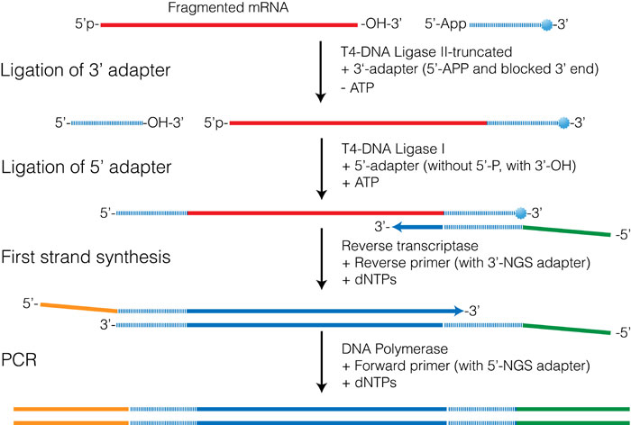

```{r,echo=FALSE}
## Set default options for the knitr RMD processing
knitr::opts_chunk$set(echo=FALSE,warning=FALSE,message=FALSE,fig.width=5,fig.height=5,cache=FALSE,autodep=TRUE, results="hide")
library(pander)
library(knitr)
library(kableExtra)
#source("functions.R")
```

```{r echo=FALSE,include=FALSE,eval=TRUE}
options(crayon.enabled = TRUE)
options(crayon.colors = 256)
knitr::knit_hooks$set(output = function(x, options){
  paste0(
    '<pre class="r-output"><code>',
    fansi::sgr_to_html(x = htmltools::htmlEscape(x), warn = FALSE),
    '</code></pre>'
  )
})

## this is an ugly, ugly hack, but otherwise crayon does not LISTEN TO REASON!!!
num_colors <- function(forget=TRUE) 256
library(crayon)
assignInNamespace("num_colors", num_colors, pos="package:crayon")
```


```{r libraries,cache=FALSE}
library(tidyverse)
```


## Omics

genome – genomics, transcriptome – transcriptomics, proteome – proteomics,
metabolome – metabolomics, metagenome – metagenomics

--

symbiome, nutrimetabonomics, morphome, CircadiOmics, consciousome,
interactomics, vaccinomics, regulomics, glycomics, interactomics...

--

Eisenomics (sequencing of genomes named after Gustav Eisen)¹ – https://eisenomics.wordpress.com/

.myfootnote[
¹ launched on April 1st, 2012
]

---

## Ridiculome

.pull-left[
"As the -ome names imply, we expect such data to be complete collections of
components and/or properties. The problem is that they are neither complete
nor correct. It has been argued that they often do not help understanding,
and have occasionally been called the 'ridiculome'."
]

.pull-right[

So, what exactly does the following figure tell us:


*Yu, Hui, et al. "Combinatorial network of transcriptional regulation and
microRNA regulation in human cancer." BMC systems biology 6.1 (2012):
1-11.*

]

.myfootnote[
Blinov, Michael L., and Ion I. Moraru. "Logic modeling and the ridiculome under the rug." BMC biology 10.1 (2012): 1-8.
]

---
class:empty-slide,myinverse
background-image:url(images/arnolfini.jpg)

.right[
.invminifootnote[
Jan Van Eyck, Arnolfini portrait, 1434
]
]

---
class:empty-slide,myinverse
background-image:url(images/arnolfini_2.jpg)

---
class:empty-slide,myinverse
background-image:url(images/arnolfini_3a.png)

---
class:empty-slide,myinverse
background-image:url(images/arnolfini_3.png)

---
class:empty-slide,myinverse
background-image:url(images/arnolfini_4.jpg)


---
class:empty-slide,myinverse
background-image:url(images/monet_4.jpg)


---
class:empty-slide,myinverse
background-image:url(images/monet_3.jpg)

---
class:empty-slide,myinverse
background-image:url(images/monet_2.jpg)

---
class:empty-slide,myinverse
background-image:url(images/monet.jpg)

.right[
.invminifootnote[
<span style="color:#999999">
Claude Monet, Saint-Georges majeur au crépuscule, 1908
</span>
]
]
---
class:empty-slide,myinverse
background-image:url(images/sangiorgio.jpg)

---

## Common characteristics of high throughput data sets

  * a lot more variables than samples, $p >> n$
  * many unknown / uncharacterized variables
  * atypical distributions
  * frequently:
      * batch effects
      * systematic bias
      * relative data (as opposed to absolute measurements in SI units)
      * large uncertainties for individual data points
      * huge files
      
---


---

## Genomics

 * Study of genomes (also: metagenomics $\sim$ comparative genomics)
 * Broader: any gene-related omics, including approaches combining several
   -omics

---

## Genomics: science of genomes

.pull-left[
Techniques:

 * High throughput sequencing
 * SNP arrays
 
Bioinformatics:

 * Sequence assembly
 * Annotation (sequence searches)
 * Phylogenomics
 * Functional predictions (binding sites, homologies etc)
 * Variant analysis
 * Genome-wide association studies
]

.pull-right[


]

---

## DNA methylation

.pull-left[
Techniques:

 * bisulfite sequencing
 * pyrosequencing
 * methylation arrays

Bioinformatics:

 * Differential methylation analysi
]

.pull-right[


]


---

## DNA binding

.pull-left[


Techniques:

 * ChIP (-on-chip, -Seq)
 * ATAC (-Seq)

Bioinformatics:

 * Peak identification
 * Differential binding
 * Motif prediction and motif search

]

.pull-right[


]

---

## Transcriptomics

.pull-left[

Techniques:

 * RNA-Seq (2nd generation sequencing)
 * Microarrays
 * Nanostring
 * QPCR

Bioinformatics:

 * Multivariate analyses (PCA etc)
 * Differential expression analysis (statistics)
 * Gene clustering
 * Functional analysis (gene enrichments – finding regulated pathways)
 * Differential transcripts
 
]

.pull-right[


]

---

## Transcriptomic parameters

(serves as an example of the complexity of each method)

 * Experimental design: number of samples needed? Which groups of samples?
   Which controls?
 * paired end or single end?
 * library size / read depth? (number of reads per sample: 5 millions, 10
   millions, 20 millions?)
 * library preparation:
    * globin depletion?
    * amplification?
    * UMI barcodes? (unique molecular identifiers)

---

## Example: Transcriptomic analysis

---

## Proteomics

.pull-left[
 
Techniques:

 * mass spectrometry
    * separation: chromatography
    * ionization: MALDI / ESI
    * analysis:
       * time of flight (TOF, e.g, MALDI-TOF)
       * Ion trap (e.g. Orbitrap)
       * quadrupole (mass filter)
    * tandem MS (MS/MS)

Bioinformatics:

 * spectrum analysis
    * protein identification
 * protein quantification, differential abundance etc.
 * functional analysis
 * protein-protein interaction networks

]

---

## Others

.pull-left[

 * Phosphoproteomics:

    * phosphorylation of proteins
    * radioisotpes for detection

 * Glycoproteomics:
   * identification of glycosylated proteins and other glycosylated
     molecules
   * cell-cell interactions
   * immune responses (glycosylation of immunoglobulins)


]

--

.pull-right[
 * Lipidomics
    * Mass spectrometry

 * Metabolomics
    * Mass spectrometry

]

---

## Single cell methods


.pull-left[

e.g. sc-RNA-Seq

 * each cell uniquely labelled
 * sequencing reaction separated (e.g. in nanodroplets)
 * transcriptome of each cell (but with low coverage)

]

.pull-right[


]


---

## Transcriptomic methods

 * QPCR: precise, low-throughput
 * Nanostring: precise, mid-throughput (~ 500-1000 genes)
 * Microarray: less exact, high-throughput, pre-defined genes
 * RNA-Seq: very flexible, less exact, high-throughput

---
class:empty-slide,myinverse
background-image:url(images/rnaseq.png)

---

.pull-left[
### Library preparation

 * cDNA synthesis
 * fragmentation
 * ligation of adapter and index sequences (and possibly UMIs, universal
   molecular identifiers)
 * purification (e.g. removing globin sequences)
 * amplification
   ]

.pull-right[



]

---

.pull-left[

### Cluster amplification

 * ligation of the cDNA to the flowcell
 * amplification in situ
 * results in spots ("clusters") with homogenous DNA

   ]

.pull-right[


]

---

.pull-left[

### Sequencing

 * "Sequencing by synthesis": Step-wise extension of the sequences
 * in each cycle, only one nucleotide is added: a protective group (-OH)
   does not allow incorporation of another nucleotide
 * a snapshot of the flow cell is taken; each cluster appears as a dot, the
   color corresponds to the last dNTP incorporated
 * fluorescence is deactivated, -OH protective group removed and another
   cycle begins

   ]

.pull-right[


]


---

.pull-left[

### Sequencing

 * "Sequencing by synthesis": Step-wise extension of the sequences
 * in each cycle, only one nucleotide is added: a protective group (-OH)
   does not allow incorporation of another nucleotide
 * a snapshot of the flow cell is taken; each cluster appears as a dot, the
   color corresponds to the last dNTP incorporated
 * fluorescence is deactivated, -OH protective group removed and another
   cycle begins

   ]

.pull-right[


]


---

.pull-left[

### Sequencing

 * "Sequencing by synthesis": Step-wise extension of the sequences
 * in each cycle, only one nucleotide is added: a protective group (-OH)
   does not allow incorporation of another nucleotide
 * a snapshot of the flow cell is taken; each cluster appears as a dot, the
   color corresponds to the last dNTP incorporated
 * fluorescence is deactivated, -OH protective group removed and another
   cycle begins

]

.pull-right[


]

---


.pull-left[

### Bioinformatics

 * convert image data to (compressed) text files (fastq files)
 * demultiplex: split sequences based on the index
 * trim adapters
 * align to a genome / exome (SAM/BAM files)
 * using a gene model (GTF files) count reads per gene
 * Quality Control

]

.pull-right[


]

---

## FASTQ files


Lines:

 1. Identifier
 2. Sequence of the read
 3. End of the sequence (`+`), optionally identifier again
 4. Phred quality score


---

## Phred quality score

 $$Q \stackrel{\text{def}}{=} -10 \cdot \log_{10}P$$


So if $Q = 10$, then error probability is 1 in 10 (one zero); if $Q = 50$, error
probability is $100,000$ (five zeros).

The $P$ (probability) is derived empirically from the signal / noise ratio
(and other metrics) in the raw data.

The number is then mapped on ASCII codes of characters, e.g. `A` has the
code of 65, which corresponds to $Q = 65 - 33 = 32$; `]` has the ASCII code
93, so $Q = 93 - 33 = 60$.

---

## BAM files


 * contain information about alignment
 * SAM = human readable text format (huge), BAM = same data but binary for
   smaller size and quicker access
 

---

## Count data

 * Matrix with integer data
 * Rows = genes (or transcripts)
 * Columns = samples

---

## Alternative representations of count data

Library size = total number of reads in a sample

 * (log) counts per million (normalized to library size)
 * RPKM: reads per kilobase of transcript per million reads (normalized to
   transcript length and library size)
 * FPKM: fragments per kilobase of transcript per million reads (normalized
   to transcript length and library size)
 * TPMs: Transcript Per Million, normalized to transcript length and
   library size (but differently)


---

### Stranded vs non-stranded


---

### Paired end vs single-end

(draw)

---

## Some advice

 * New technologies and new applications arise all the time
 * New technology curve: first steeply up, then steeply down, then level out
 * In 10 years, the landscape will be very different (high throughput cheap
   single cell proteomics? spatial single cell transcriptomics?)
 * Learn the meta-trade, not the trade, so you can adapt to new
   technologies:
   * Learn how to program
   * Teach yourself to figure out how to use existing workflows
   * Stick to the reproducibility principles
