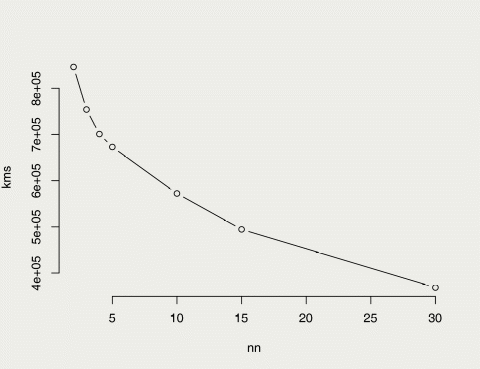
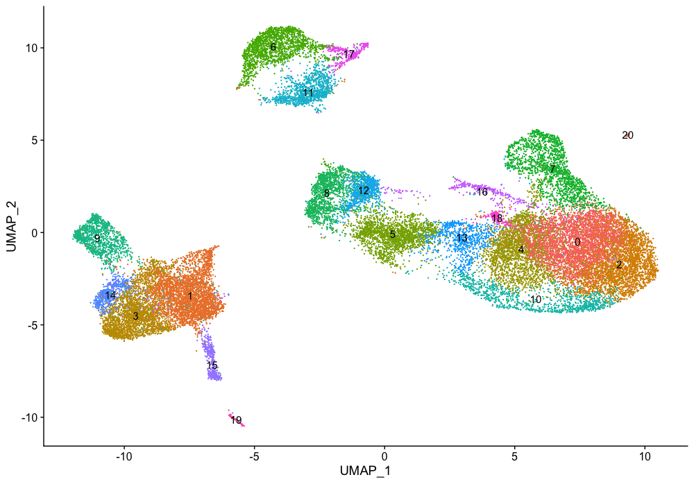
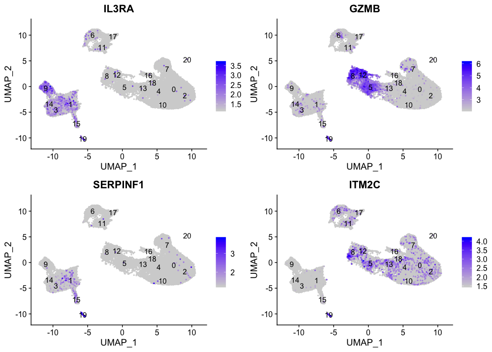
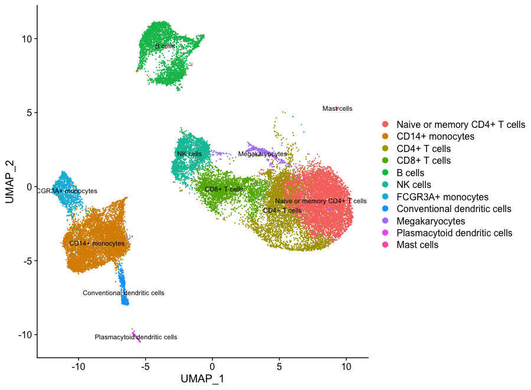

```{r,echo=FALSE}
## Set default options for the knitr RMD processing
knitr::opts_chunk$set(echo=FALSE,warning=FALSE,message=FALSE,fig.width=5,fig.height=5,cache=FALSE,autodep=TRUE, results="hide")
library(pander)
library(knitr)
library(kableExtra)
#source("functions.R")
```

```{r echo=FALSE,include=FALSE,eval=TRUE}
options(crayon.enabled = TRUE)
options(crayon.colors = 256)
knitr::knit_hooks$set(output = function(x, options){
  paste0(
    '<pre class="r-output"><code>',
    fansi::sgr_to_html(x = htmltools::htmlEscape(x), warn = FALSE),
    '</code></pre>'
  )
})

## this is an ugly, ugly hack, but otherwise crayon does not LISTEN TO REASON!!!
num_colors <- function(forget=TRUE) 256
library(crayon)
assignInNamespace("num_colors", num_colors, pos="package:crayon")
```


```{r libraries,cache=FALSE}
library(tidyverse)
library(ggplot2)
library(readxl)
library(cowplot)
library(RColorBrewer)
library(cluster)
library(factoextra)
library(pca3d)
```

<!--
class:empty-slide,myinverse
background-image:url(images/arnolfini.jpg)
-->


```{r data loading etc.,cache=TRUE}
rgs <- readRDS("../../Datasets/rgs.rds")
.vars <- apply(rgs$E, 1, var)
rgsS <- rgs[ .vars > quantile(.vars, .99), ]
.cors <- cor(t(rgsS$E))
```

# Clustering

 * "unbiased" machine learning
 * group data points (samples, genes, ...) by similarity
 * applications in many areas of bioinformatics

---


.pull-left[
## Why cluster the genes?

 * Genes which are co-regulated have similar function $\rightarrow$
   identification of "transcriptional modules"
 * Analysis of the clusters may give us clues about what is happening in
   the biological system
 * Better visualization if genes are clustered

]

.pull-right[

```{r fig.width=5,fig.height=10,results="markdown",out.width="60%",cache=TRUE}
gn1 <- "FCGR1B"
gn2 <- "ANKRD22"
gn3 <- "OR51A4"

id1 <- rgs$genes$ProbeName[ match(gn1, rgs$genes$GeneName) ]
id2 <- rgs$genes$ProbeName[ match(gn2, rgs$genes$GeneName) ]
id3 <- rgs$genes$ProbeName[ match(gn3, rgs$genes$GeneName) ]

theme_set(theme_bw())

df <- data.frame(rgs$targets, g1=rgs$E[id1, ], g2=rgs$E[id2, ], g3=rgs$E[id3, ])

g1 <- ggplot(df, aes(x=g1, y=g2, color=ARM, symbol=Timepoint)) + geom_point(color="#33333366") +
  scale_color_brewer(palette = "Dark2") + xlab(gn1) + ylab(gn2)
g2 <- ggplot(df, aes(x=g1, y=g3, color=ARM, symbol=Timepoint)) + geom_point(color="#33333366") +
  scale_color_brewer(palette = "Dark2") + xlab(gn1) + ylab(gn3)
plot_grid(g1, g2, nrow=2)
```
]

---
class:empty-slide,mywhite
background-image:url(images/network_1.png)


---
class:empty-slide,mywhite
background-image:url(images/network_2.png)

---

### From correlations to distances

 $d_{i,j}$ – Distance between genes $i$ and $j$

 $\rho(x_i, x_j)$ – correlation coefficient between expression of $i$ $x_i$ and $j$ $x_j$

Hard threshold:

 $$d_{i,j} \equiv \left\{\begin{array}{ll}0 & |\rho(x_i, x_j)| > \tau\\1 & |\rho(x_i, x_j)| \leq \tau\end{array}\right.$$

Continuouos in $(0, 1)$

 $$d_{i,j} \equiv 1 - |\rho(x_i, x_j)|$$


---
class:empty-slide,mywhite
background-image:url(images/correlation_modules.png)


---
class:empty-slide,mywhite
background-image:url(images/correlation_dependence.png)


---

## Many alternatives

 Other measures exist:

   * mutual information
   * different types of correlation (Spearman $\rho$, Kendall $\tau$)
   * distance correlation (Székely 2007)


Bottom line: we need to get at distances

---
class:empty-slide,myinverse
background-image:url(images/desert2.jpg)

.mytop[
The number of grains of sand in this picture accurately represents the
number of clustering algorithms.
]

--
.mytop[
<br/>
<br/>
<br/>
<br/>
<br/>
Each tree in the picture corresponds to a method of clustering which is
robust, reliable and provides automatically high quality clusters. 
]


---
class:empty-slide,myinverse
background-image:url(images/desert2.jpg)

.pull-left[
.transpblock[
**PAM** Partitioning Around Medoids. Similar to k-means;
predefined number of clusters
]

.transpblock[
**SOMs**, Self-organizing maps:
Train a neural network to recognize clusters in the data
(also SOTA: self-organizing trees)
]

.transpblock[
**SVC** – support vector clustering;
based on SVM’s (support vector machines)
]


.transpblock[
**Fuzzy C-means clustering**:
Each sample gets assigned a probability of
belonging to each of the clusters.
Algorithm similar to k-means.
Also similar – “soft k-means”
]

]

.pull-right[

.transpblock[
**Hierarchical clustering:** UPGMA (group-average linkage), Ward's method, neighbor joining, single
linkage, complete linkage...

]

.transpblock[
**Mclust** – model based clustering
The data is fit to a statistical model consisting of K normal distributions.
]

.transpblock[
**Density based clustering:**
identify clusters by local density profiles
]

]

---

### Hierarchical clustering

 * Start with each element in its own cluster: $n_{\text{clust}} = N$
 * Identify two elements with the smallest distance
 * Recalculate distances using a *linkage* function

E.g. complete linkage:

 $$D(C_i, C_j) = \max_{e_i \in C_i, e_j \in C_j} D(e_i, e_j)$$

Basically: join the clusters with the smalles distance between the
*furthest* elements of the clusters

E.g. single linkage:

 $$D(C_i, C_j) = \min_{e_i \in C_i, e_j \in C_j} D(e_i, e_j)$$

Basically: join the clusters with the smalles distance between the
*closest* elements of the clusters

---
class:empty-slide,mywhite
background-image:url(images/hclust.png)


---

## k-means

Naive k-means:

 * Assign the elements to random clusters
 * Repeat:
   * Calculate the cluster centroids (midpoints) 
   * Assign the elements to the cluster with the closest centroid
   * Abort if the asignments no longer change

```{r}
# generates random clusters
get_clusts <- function(centr, sds, N) {
  clusts <- map2(centr, sds, ~ {
                   cc <- .x
                   sd <- .y
                   ret <- map(cc, ~ rnorm(N, mean=.x, sd=sd)) %>% reduce(cbind)
                   colnames(ret) <- paste0("V", 1:ncol(ret))
                   ret
     })
  clusts <- imap_dfr(clusts, ~ data.frame(.x, Cl=.y))

  clusts$KM <- sample(names(centr), nrow(clusts), replace = TRUE)
  return(clusts)
}

centres <- list(A=c(0,0), B=c(-1,1), C=c(1,1))
sds   <- c(.5, .5, .5)
clusts <- get_clusts(centres, sds, 55)
cldist <- function(x, y) {
  ## y is a matrix, x is a vector


}
gplots <- list()

for(i in 1:10) {
  gplots[[i]] <- ggplot(clusts, aes(V1, V2, color=KM)) + geom_point()
  centr <- clusts %>% group_by(KM) %>% 
    summarise(across(starts_with("V"), mean)) 
  mtx <- rbind(
               data.matrix(centr %>% select(starts_with("V"))),
               data.matrix(clusts %>% select(starts_with("V")))
               )
  dists <- dist(mtx) %>% as.matrix 
  dists <- dists[ -1:-3, 1:3 ]

  clusts <- clusts %>% mutate(
                            KM=centr[["KM"]][ apply(dists, 1,
                                                    which.min)
                            ])
}

```

.center[
```{r fig.width=8,fig.height=5}
gplots[1]
```
]

---


.center[
```{r fig.width=8,fig.height=5,animation.hook="gifski",cache=TRUE}
for(i in 1:length(gplots)) {
  print(gplots[[i]] + ggtitle(paste0("Step: ", i)))
}
```
]

---

## Measuring clustering performance

.pull-left[

 * How many clusters?

 * Which clustering method?

 * What parameters?
]

--

.pull-right[

 * Internal: information scientific

 * Stability measures: cross-validation, resampling (like bootstrapping in
   phylogenies!)

 * External: use external information
   * a priori information
   * biological information (how well the clusters correspond to
      underlying biology)

]

---
class:empty-slide,myinverse
background-image:url(images/desert2.jpg)

--

.mytop[
The number of grains of sand in this picture accurately represents the
number of available measures of clustering performance.
]


---

## The elbow method

.pull-left[
There is a total amount of variance in the clusters.

We can split it into *between cluster* variance and *within cluster*
variance.

Instead of variance, we use Sum of Squares (SS), because $Var(x)\equiv \frac{SS}{n-1}$.

 $$SS_{\text{tot}} = SS_{\text{within}} + SS_{\text{between}}$$

 * If all elements are in one large cluster, $SS_{\text{between}}= 0$.
 * If all elements are each in a separate cluster, $SS_{\text{within}}= 0$.
]

.pull-right[





]

---

## Silhouette plots

.pull-left[

For each element, we plot the difference between distance to the center of
the cluster where that element is and the distance to the closest *other*
cluster center.

]

.pull-right[

```{r}
cl <- list(
clusts1=get_clusts(centres, c(.2, .2, .2), 20),
clusts2=get_clusts(centres, c(.7, .7, .7), 20),
clusts3=get_clusts(centres, c(1.5, 1.5, 1.5), 20))

mtx <- map(cl, ~ as.matrix(.x[, c("V1", "V2")]))
#km <- map(mtx, ~ kmeans(.x, 3)$cluster)
km <- map(cl, ~ as.numeric(factor(.x[["Cl"]])))
dd <- map(mtx, ~ dist(.x))
sl <- map2(km, dd, ~ silhouette(.x, .y))
pal <- brewer.pal(3, "Dark2")
```

```{r}
theme_set(theme_bw())
fviz_silhouette(sl[[1]]) + coord_flip() + 
  scale_fill_brewer(palette = "Dark2") +
  scale_color_brewer(palette = "Dark2")
```


]

---

```{r fig.width=14,fig.height=7}
i <- 1
g1 <- ggplot(cl[[i]], aes(V1, V2, color=Cl)) + geom_point() +
  scale_color_brewer(palette = "Dark2") + stat_ellipse()
g2 <- fviz_silhouette(sl[[i]]) + coord_flip() + 
  scale_fill_brewer(palette = "Dark2") +
  scale_color_brewer(palette = "Dark2")
plot_grid(g1, g2)
```


---

```{r fig.width=14,fig.height=7}
i <- 2
g1 <- ggplot(cl[[i]], aes(V1, V2, color=Cl)) + geom_point() +
  scale_color_brewer(palette = "Dark2") + stat_ellipse()
g2 <- fviz_silhouette(sl[[i]]) + coord_flip() + 
  scale_fill_brewer(palette = "Dark2") +
  scale_color_brewer(palette = "Dark2")
plot_grid(g1, g2)
```


---

```{r fig.width=14,fig.height=7}
i <- 3
g1 <- ggplot(cl[[i]], aes(V1, V2, color=Cl)) + geom_point() +
  scale_color_brewer(palette = "Dark2") + stat_ellipse()
g2 <- fviz_silhouette(sl[[i]]) + coord_flip() + 
  scale_fill_brewer(palette = "Dark2") +
  scale_color_brewer(palette = "Dark2")
plot_grid(g1, g2)
```


---

Another example: clustering of single cell data



---

Another example: clustering of single cell data




---

Another example: clustering of single cell data


