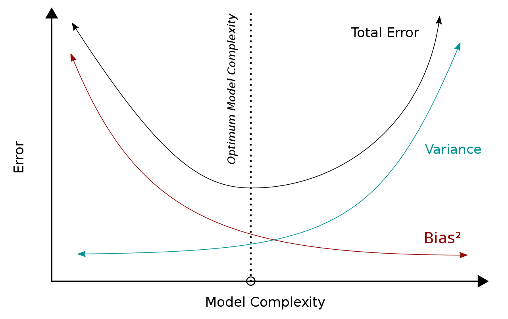
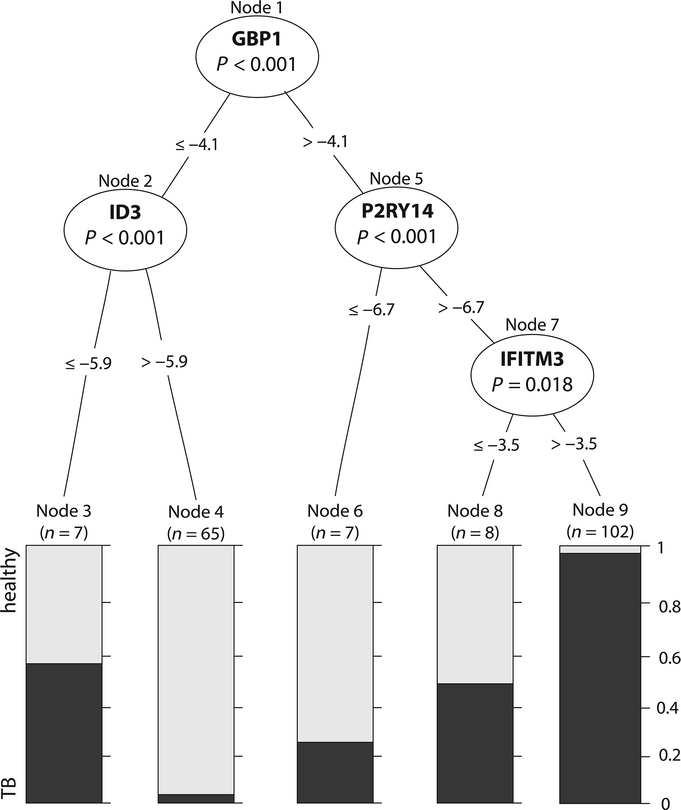
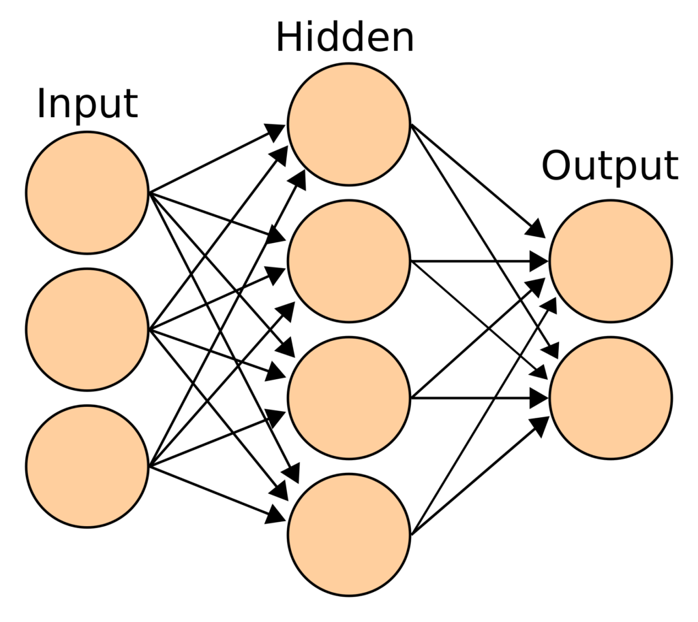
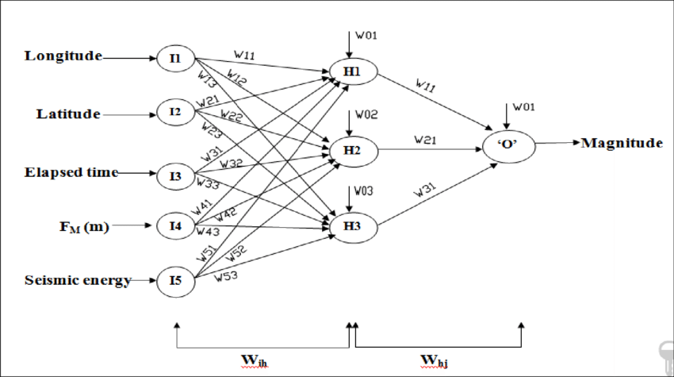
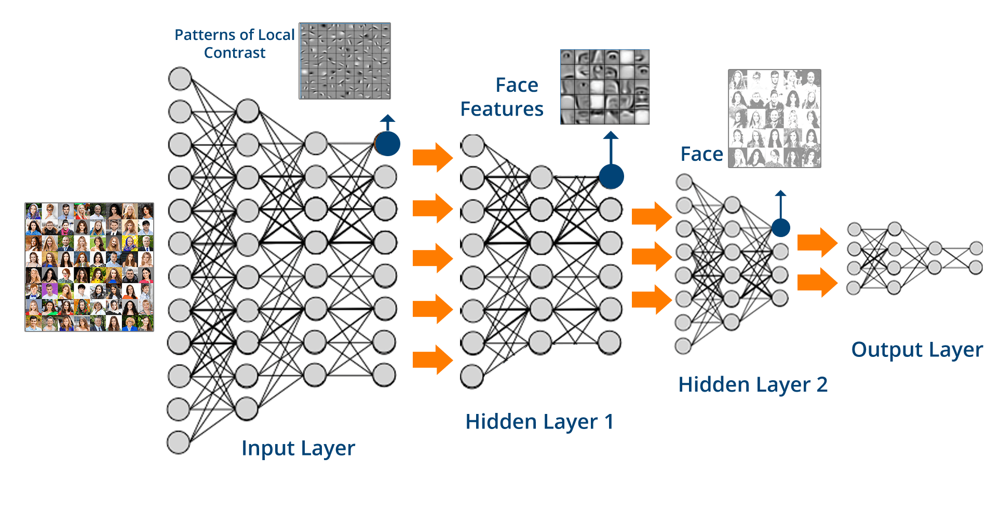

```{r,echo=FALSE}
## Set default options for the knitr RMD processing
knitr::opts_chunk$set(echo=TRUE,warning=FALSE,message=FALSE,fig.width=5,fig.height=5,cache=FALSE,autodep=TRUE, results="hide",dev="svg")
```

```{r, echo=FALSE}
library(pander)
library(knitr)
library(kableExtra)
library(tidyverse)
library(ggplot2)
library(pROC)
#source("functions.R")
```

```{r echo=FALSE,include=FALSE,eval=TRUE}
options(crayon.enabled = TRUE)
options(crayon.colors = 256)
knitr::knit_hooks$set(output = function(x, options){
  paste0(
    '<pre class="r-output"><code>',
    fansi::sgr_to_html(x = htmltools::htmlEscape(x), warn = FALSE),
    '</code></pre>'
  )
})

## this is an ugly, ugly hack, but otherwise crayon does not LISTEN TO REASON!!!
num_colors <- function(forget=TRUE) 256
library(crayon)
assignInNamespace("num_colors", num_colors, pos="package:crayon")
```


## What is machine learning?

---
class:empty-slide,myinverse
background-image:url(images/person-statistics-machine-learnine-machine-learning-sand.jpeg)

---

.pull-left[

### Unsupervised machine learning:✪ 

 * algorithm
 * data set
 * no "training data"
 * no classes / results to be predicted
 * validation data set

]

.pull-right[

### Supervised machine learning:✪ 

 * algorithm
 * training data set
 * classes / results to be predicted
 * test data set
 * validation data set

]

---

## Classification vs regression problems ✪ 

.pull-left[

### Classification

 * discrete output
 * e.g. "is this a cat or a dog?"
 * e.g. "is this a TB patient or a healthy individual?"

]

.pull-right[

### Regression

 * continuous output
 * e.g. "what is the age of this person?"
 * e.g. "what is the concentration of this metabolite?"

]


---
class:empty-slide,myinverse
background-image:url(images/desert2.jpg)

.mytop[
The number of grains of sand in this picture accurately represents the
number of machine learning algorithms.
]

---

## Example: simple machine learning using PCA

The idea: 

 * select only versicolor and virginica from the iris data set
 * calculate PCA from the iris data set
 * determine a threshold value on the PC1
 * see what the results are

---

.pull-left[

```{r iris_pca,eval=FALSE}
set.seed(12345)
library(ggplot2)
library(tidyverse)
theme_set(theme_bw())
data(iris)
iris <- iris %>% filter(Species != "setosa") %>%
  mutate(Species=factor(Species))
pca <- prcomp(iris[,1:4], scale.=TRUE)
df <- cbind(iris, pca$x)
ggplot(df, aes(x=PC1, y=PC2, color=Species)) + 
  geom_point()
```

 * This is not supervising learning yet
 * PCA by itself is unsupervised learning
 * However, we can use it to discriminate between two classes - we need to
   define a cutoff value

]

.pull-right[

```{r iris_pca,echo=FALSE}
```

]


---


.mycenter[Warning, what follows is incorrect!]


---

## INCORRECT!

.pull-left[

To discriminate, define a cutoff between the two groups.

```{r results="markdown"}
cutoff <- 0.08

ml_guess <- ifelse(df$PC1 < cutoff, 
                   "virginica", "versicolor")
tmp <- table(ml_guess, df$Species)
print(tmp)
```

Error rate = $(`r tmp[1,2]` + `r tmp[2,1]`)/`r sum(tmp)`  = `r sprintf("%.1f%%", 100 * (tmp[1,2] + tmp[2,1])/ sum(tmp))`$

]


.pull-right[

```{r echo=FALSE}
ggplot(df, aes(x=PC1, y=PC2, color=Species)) + 
  geom_point() + geom_vline(xintercept=cutoff, color="red", size=3)
```

]


---


## Why is that incorrect?

 * We train the model (PCA) with the full data set
 * We *test* the model with the *same* data set.
 * Testing efficiency on the data that was used to predict the model is
   *overfitting*


---

## Correct approach

Select training and testing sets:

.pull-left[

```{r}
set.seed(1234)

# training set
train <- sample(1:nrow(iris),
                size = nrow(iris) * 2/3)
# remainder is test set
test  <- setdiff(1:nrow(iris),
                 train) 

model <- prcomp(iris[train, 1:4], scale.=TRUE)
df_train <- cbind(iris[train, ], model$x)
cutoff <- -0.1 ## just by looking!
```

]

.pull-right[

Results in training set:

```{r results="markdown"}
train_pred <- ifelse(df_train$PC1 > cutoff, 
                     "versicolor",
                     "virginica")
tmp <- table(train_pred, df_train$Species)
print(tmp)
```

Error rate = $(`r tmp[1,2]` + `r tmp[2,1]`)/`r sum(tmp)`  = `r sprintf("%.1f%%", 100 * (tmp[1,2] + tmp[2,1])/ sum(tmp))`$
]

---

Now check in the test set:

```{r results="markdown"}
test_pred_df <- data.frame(predict(model, iris[test, 1:4]))
test_pred <- ifelse(test_pred_df$PC1 > cutoff, 
                     "versicolor",
                     "virginica")
tmp <- table(test_pred, iris[test, ]$Species)
print(tmp)
```

Error rate = $(`r tmp[1,2]` + `r tmp[2,1]`)/`r sum(tmp)`  = `r sprintf("%.1f%%", 100 * (tmp[1,2] + tmp[2,1])/ sum(tmp))`$


---

## Positive vs negative: Another example


.pull-left[

Metabolomic data set to discriminate between tuberculosis (TB) patients and healthy
individuals.

]

.pull-right[

```{r echo=FALSE}
load("metabo.rda")
mtb_group <- metabo[,1]
mtb_group <- ifelse(mtb_group == "TB", "TB", "HEALTHY")
mtb_dat   <- metabo[,-1]
pca <- prcomp(mtb_dat, scale.=TRUE)
mtb_pca <- data.frame(Group=mtb_group, pca$x[,1:2])
ggplot(mtb_pca, aes(x=PC1, y=PC2, color=Group)) + geom_point()
#ggplot(metabo, aes(x=X379, y=X127, color=mtb_pca$Group)) + geom_point()
N <- length(mtb_group)

set.seed(1234)
train <- sample(1:N, size=2/3 * N)
test  <- setdiff(1:N, train)
```

]

.myfootnote[Weiner 3rd, January, et al. "Biomarkers of inflammation,
immunosuppression and stress are revealed by metabolomic profiling of
tuberculosis patients." PloS one 7.7 (2012): e40221.]

---

## Linear discriminant analysis

Idea: create a function which is a *linear combination* of the variables
(in our case, of the principal components 1 and 2).  That is,

 $$f_{LD} = b_1 \cdot PC_1 + b_2 \cdot PC_2$$

The coefficients are constructed in such a way that they maximize the
differences between groups on this function.

In other words, the higher the value of the function, the higher the
likelihood that the given sample belongs to a certain class.

```{r echo=FALSE}
library(MASS)
mod_lda <- lda(Group ~ ., data=mtb_pca[train,])
```


 $$f_{LD} = -0.18 \cdot PC_1 + 0.21 \cdot PC_2$$

Note that the only reason we are running it on the PC variables is to have
a simple situation. Normally, you can run the LDA directly on the variables
(e.g. petal and sepal measurements from the Iris data set). In the original
paper, Fisher applied it to the iris data set.

---

 $$f_{LD} = -0.18 \cdot PC_1 + 0.21 \cdot PC_2$$

```{r echo=FALSE,fig.width=10,fig.height=5.5}
library(cowplot)
g1 <- ggplot(mtb_pca, aes(x=PC1, y=PC2, color=Group)) + geom_point()
tmp <- expand.grid(list(PC1=seq(-10, 10), PC2=seq(-10, 10)))
tmp_pred <- predict(mod_lda, tmp)
tmp <- data.frame(tmp, LD=tmp_pred$x[,1])
g2 <- ggplot(tmp, aes(x=PC1, y=PC2, color=LD)) + geom_point(size=4)

tmp <- predict(mod_lda, mtb_pca)
tmp <- cbind(mtb_pca, LD=tmp$x[,1])

g3 <- ggplot(tmp, aes(x=PC1, y=LD)) + geom_line()
g4 <- ggplot(tmp, aes(x=PC2, y=LD)) + geom_line()
plot_grid(g1, g2, g3, g4, nrow=2)
```

---

## Bottom line

 * The machine algorithm generates a function of the data
 * The function gives a measure of likelihood that a certain data point is
   one of the two classes
 * We choose a threshold to determine which of the two classes this
   data point belongs to

```{r echo=FALSE,fig.height=5,fig.width=10}
tmp <- predict(mod_lda, mtb_pca)
tmp <- cbind(mtb_pca, LD=tmp$x[,1])
g1 <- ggplot(mtb_pca, aes(x=PC1, y=PC2, color=Group)) + geom_point(show.legend=FALSE) +
   ggtitle("Reality")

g2 <- ggplot(tmp, aes(x=PC1, y=PC2, color=
                      ifelse(LD > 1, "TB", "HEALTHY"))) + geom_point(show.legend=FALSE) +
                      ggtitle("LD > 1")
g3 <- ggplot(tmp, aes(x=PC1, y=PC2, color=
                      ifelse(LD > 0, "TB", "HEALTHY"))) + geom_point(show.legend=FALSE) +
                      ggtitle("LD > 0")
g4 <- ggplot(tmp, aes(x=PC1, y=PC2, color=
                      ifelse(LD > -1, "TB", "HEALTHY"))) + geom_point(show.legend=FALSE) +
                      ggtitle("LD > -1")
plot_grid(g1, g2, g3, g4, nrow=1)
```

---

For each of these situations, we can calculate the error rates.
To this end, we only use the **test data!** 
(`r length(test)` samples)

```{r}
mtb_test <- mtb_pca[test,]
mtrain_pred <- predict(mod_lda, mtb_test)
mtb_test$LD <- mtrain_pred$x[,1]
```


.pull-left[

**LD > -1**:

```{r results="markdown", echo=FALSE}

pr <- ifelse(mtb_test$LD > -1, "TB", "HEALTHY")
tmp <- table(pr, mtb_test$Group)
print(tmp)
```

Error rate = `r tmp[1,2] + tmp[2,1]` / `r sum(tmp)` = `r sprintf("%.0f", 100 * (tmp[1,2] + tmp[2,1]) / sum(tmp))`  %


**LD > 0**:

```{r results="markdown", echo=FALSE}

pr <- ifelse(mtb_test$LD > 0, "TB", "HEALTHY")
tmp <- table(pr, mtb_test$Group)
print(tmp)
```

Error rate = `r tmp[1,2] + tmp[2,1]` / `r sum(tmp)` = `r sprintf("%.0f", 100 * (tmp[1,2] + tmp[2,1]) / sum(tmp))`  %

]

.pull-right[

**LD > 1**:

```{r results="markdown", echo=FALSE}

pr <- ifelse(mtb_test$LD > 1, "TB", "HEALTHY")
tmp <- table(pr, mtb_test$Group)
print(tmp)
```

Error rate = `r tmp[1,2] + tmp[2,1]` / `r sum(tmp)` = `r sprintf("%.0f", 100 * (tmp[1,2] + tmp[2,1]) / sum(tmp))`  %

**LD > 2**:

```{r results="markdown", echo=FALSE}

pr <- ifelse(mtb_test$LD > 2, "TB", "HEALTHY")
tmp <- table(pr, mtb_test$Group)
print(tmp)
```

Error rate = `r tmp[1,2] + tmp[2,1]` / `r sum(tmp)` = `r sprintf("%.0f", 100 * (tmp[1,2] + tmp[2,1]) / sum(tmp))`  %

]

---

## FP, FN, TP, TN✪ 

.pull-left[

**LD > 0**:

```{r results="markdown", echo=FALSE}

pr <- ifelse(mtb_test$LD > 0, "TB", "HEALTHY")
tmp <- table(pr, mtb_test$Group)
print(tmp)
```

]

.pull-right[

Four important abbreviations:

 * **TP** (`r tmp[2,2]`) - true positive. These are patients correctly classified as patients.
 * **TN** (`r tmp[1,1]`) - true negative. These are healthy individuals correctly classified as healthy.
 * **FP** (`r tmp[2,1]`) - false positive. These are healthy individuals incorrectly classified as patients.
 * **FN** (`r tmp[1,2]`) - false negative. These are patients incorrectly classified as healthy.


Total number of patients: $P = TP + FN =$ `r tmp[2,2]` $+$ `r tmp[1,2]` $=$ `r sum(tmp[,2])`

Total number of healthy individuals: $N = TN + FP =$ `r tmp[1,1]` $+$ `r tmp[2,1]` $=$ `r sum(tmp[,1])`

]

---

## Let us take a closer look at LD > 1

**LD > 1**:

```{r results="markdown", echo=FALSE}

pr <- ifelse(mtb_test$LD > 1, "TB", "HEALTHY")
tmp <- table(pr, mtb_test$Group)
print(tmp)
```

Reality is in columns, predictions in rows.

There are `r tmp[2,1]` false positives (FP) and `r tmp[1,2]`
false negatives (FP). At the same time, there 
are `r tmp[1,1]` true negatives (TN) 
and `r tmp[2,2]` true positives (TP).

--


We can calculate a whole lot of different abbreviations with that!

FPR, TNR, PPV, NPV, FNR, FDR, FOR, PT, TS, ...

(The graphics on the next slide comes from [Wikipedia](https://en.wikipedia.org/wiki/Positive_and_negative_predictive_values))

---
class:empty-slide,mywhite
background-image:url(images/tlas.png)

---

## Let us take a closer look at LD > 1✪ 

**LD > 1**:

```{r results="markdown", echo=FALSE}

pr <- ifelse(mtb_test$LD > 1, "TB", "HEALTHY")
tmp <- table(pr, mtb_test$Group)
print(tmp)
```

There are `r tmp[2,1]` false positives (FP) and `r tmp[1,2]`
false negatives (FP). At the same time, there 
are `r tmp[1,1]` true negatives (TN) 
and `r tmp[2,2]` true positives (TP).

FPR✪  describes the proportion of healthy patients that have been
misclassified:

 $$FPR \stackrel{\text{def}}{=} \frac{FP}{FP + TN}$$

In our case, FPR = `r tmp[2,1]` / `r sum(tmp[,1])` = `r sprintf("%.0f", tmp[2,1] / sum(tmp[,1]) * 100)` %

--

Similarly, FNR✪  is the false negative rate and describes the proportion of
tuberculosis patients that have been classified as healthy.

 $$FNR \stackrel{\text{def}}{=} \frac{FN}{FN + TP}$$

In our case, FPR = `r tmp[1,2]` / `r sum(tmp[,2])` = `r sprintf("%.0f", tmp[1,2] / sum(tmp[,2]) * 100)` %


---

## Sensitivity and specificity✪  


.pull-left[

**LD > -1**:

```{r results="markdown", echo=FALSE}

pr <- ifelse(mtb_test$LD > -1, "TB", "HEALTHY")
tmp <- table(pr, mtb_test$Group)
print(tmp)
```

All TB patients have been classified as positive! Very sensitive. However, 
specificity is poor: 21 of the healthy individuals have been classified as
TB.


**LD > 0**:

```{r results="markdown", echo=FALSE}

pr <- ifelse(mtb_test$LD > 0, "TB", "HEALTHY")
tmp <- table(pr, mtb_test$Group)
print(tmp)
```

Slightly less sensitive, but way more specific.

]

.pull-right[

**LD > 1**:

```{r results="markdown", echo=FALSE}

pr <- ifelse(mtb_test$LD > 1, "TB", "HEALTHY")
tmp <- table(pr, mtb_test$Group)
print(tmp)
```

Way less sensitive, but much more specific.


**LD > 2**:

```{r results="markdown", echo=FALSE}

pr <- ifelse(mtb_test$LD > 2, "TB", "HEALTHY")
tmp <- table(pr, mtb_test$Group)
print(tmp)
```

Best specificity so far (no FPs at all!), but really poor sensitivity.

]

---

## Formal definitions✪ 

.pull-left[

### Sensitivity

 * recall, TPR, probability of detection, power

 $$SEN = \frac{TP}{TP + FN} = \frac{TP}{P} = 1 - FNR$$

(where P is the total number of real patients, detected and undetected)

This is the fraction of all the real patients that we were able to detect.

Low sensitivity $\rightarrow$ many patients incorrectly misclassified as healthy
individuals.

]

.pull-right[

### Specificity

 * TNR, selectivity

 $$SPC = \frac{TN}{N} = 1 - FPR$$

(where N is the total number of healthy individuals, detected and undetected)

This is the fraction of all healthy individuals which we recognized as healthy.

Low specificity $\rightarrow$ many healthy individuals incorrectly classified as
patients.

]


---

## What if we plot SPC vs SEN for our data?✪ 

```{r echo=FALSE}
thr <- seq(-2, 2, length.out=100)

sen <- map_dbl(thr, ~ {
  pr <- ifelse(mtb_test$LD > .x, "TB", "HEALTHY")
  tmp <- table(pr, mtb_test$Group)
  sen <- tmp[2,2] / sum(tmp[,2])
                     })

spc <- map_dbl(thr, ~ {
  pr <- ifelse(mtb_test$LD > .x, "TB", "HEALTHY")
  tmp <- table(pr, mtb_test$Group)
  sen <- tmp[1,1] / sum(tmp[,1])
                     })

ggplot(data.frame(SPC=spc, SEN=sen),
       aes(x=SPC, y=SEN)) + geom_line()

```

---

## Receiver-operator characteristic (ROC) curves✪ 

.pull-left[

```{r echo=FALSE}
rp <- roc(response=mtb_test$Group, predictor=mtb_test$LD, plot=TRUE,
          ci=TRUE,
  levels=c("HEALTHY", "TB"))

```

]

.pull-right[

*Area under the curve*,
AUC = `r sprintf("%.2f [95%% CI %.2f-%.2f]", rp$ci[2], rp$ci[1], rp$ci[3])`

]

---

## Some other important TLA's (three-letter acronyms)

 * Prevalence: $\frac{TP + FN}{TP + FN + TN + FP} = \frac{P}{P + N}$

 * Positive predictive value (PPV), precision: $\frac{TP}{TP + FP}$
 
 * False discovery rate (FDR) $\frac{FP}{TP + FP} = 1 - PPV$

 * Negative predictive value (NPV), $\frac{TN}{TN + FN}$

Where

 * FN = false negative
 
 * FP = false positive
 
 * TN = true negative

 * TP = true positive

---

## PPV and NPV✪

.pull-left[
### PPV - positive predictive value, precision

 * probability that a patient is really a patient given that the test is
   positive

 * Same as $1 - FDR$

 * $\frac{TP}{TP + FP}$

 * in our case, PPV = `r tmp[2,2]` / `r sum(tmp[,2])` = `r sprintf("%.0f", 100 * tmp[2,2] / sum(tmp[,2]))` %

]

.pull-right[

### NPV - negative predictive value

 * probability that a healthy individual is really healthy given that the
   test is negative

 * $\frac{TN}{TN + FN}$

 * in our case, NPV = `r tmp[1,1]` / `r sum(tmp[,1])` = `r sprintf("%.0f", 100 * tmp[1,1] / sum(tmp[,1]))` %

]

PPV and NPV are more useful than sensitivity and specificity in clinical
practice, but...

---

## PPV and NPV depend on prevalence✪

If we are to get *real* probabilities that a given person with a positive
test result really is sick, then we cannot use the test setting, in which
the prevalence of the disease is artificially set to 50%.

Instead, we need to use the *actual* prevalence of the disease in the
population.

.pull-left[

$PPV = \frac{sensitivity \times prevalence}{sensitivity \times prevalence + (1 - specificity) \times (1 - prevalence)}$

 * If prevalence is high, PPV is high
 * The lower the prevalence, the lower the PPV

]

.pull-right[

$NPV = \frac{specificity \times (1 - prevalence)}{specificity \times (1 - prevalence) + (1 - sensitivity) \times prevalence}$

 * If prevalence is high, NPV is low
 * The higher the prevalence, the higher the NPV

]

---

## Cross-validation✪ 

Splitting data set into training and test set:

 * we cannot build prediction based on the same data that was used to
   construct the model (**overfitting**)
 * training set small, so learning efficiency takes a hit
 * test set small, so errors in estimation (confidence intervals large)

Solution: cross-validation


---

## LOO (leave-one-out)✪ 


```
# pseudocode

for i in samples:
  train := samples[ -i ]
  test  := samples[  i ]
  model := algorithm(train)
  prediction := model(test)
  record(i, prediction)
```

In each iteration, we take out *one* sample. We then use all the remaining
samples to create the model, we apply it to the one remaining sample (which
is our test), and we record that prediction.

After all samples are through, we have as many predictions as we have total
samples, but we avoided overfitting.

---

## K-fold cross-validation✪ 

Pseudocode:

```
folds := split(data, 10)
for i in 1:10:
  train := folds[-i]
  test  := folds[i]
  model := algorithm(train)
  prediction := model(test)
  record(i, prediction)
```

We split the data in e.g. 10 subsets = folds. For each fold, we treat it as
a test set, and  we use all the remaining folds to create a model. We then
apply the model to the test fold and record the predictions.

After all folds have been analysed we have no overfitting, but we have
predictions for all samples.


---

## Bias-variance tradeoff✪ 

Two important concepts:

 * **bias** results from model being inaproppriate for the data (or too
   simple) – that is, model is underfitting the data
 * **variance** results from model being too close to the training data (or
   too complex) – that is, model is overfitting the data


---

## Bias-variance tradeoff


---

## Bias-variance tradeoff



 


---
class:empty-slide,mywhite
background-image:url(images/machine_learning.png)

---

## Some notable (useful) simple algorithms for classification

 * **decision trees** - a tree-like structure where each node is a decision
   based on a feature, and each leaf is a class
 * **random forests** - a collection of decision trees, each trained on a
   different subset of the data
 * **support vector machines** (SVMs) - a hyperplane that separates the classes
   with the largest margin
 * **naive Bayes** - a probabilistic classifier based on Bayes' theorem
 * **logistic regression** - a regression model for binary outcomes
 * **linear discriminant analysis** - a linear combination of features
 * **neural networks** - a complex model that can learn complex patterns in
   the data

This is useful to know!

---

## Decision trees

.pull-left[



]

*Maertzdorf J, McEwen G, Weiner 3rd J, Tian S, Lader E, Schriek U,
Mayanja‐Kizza H, Ota M, Kenneth J, Kaufmann SH. Concise gene signature for
point‐of‐care classification of tuberculosis. EMBO molecular medicine. 2016
Feb;8(2):86-95.*


---

## How does ChatGPT work?

--

 * ChatGPT is an interface to a GPT (3.5, 4, ...) model
 * GPT stands for generative pre-trained transformer
 * which is a type of a deep learning network
 * which is a type of a neural network

---

## Neural networks

.pull-left[

]

.pull-right[
How it works:

 * each node takes the value which is the sum of incoming signals
 * if the signals exceed a threshold, the node is "activated"
 * activated node emits signals
]

---

## Neural networks



.myfootnote[Amit, Zarola, and Sil Arjun. "Quantification of recent
seismicity and a back propagation Neural Network for forecasting of
earthquake magnitude in Northeast Region of India." Disaster Advances 10.6
(2017): 17-34.]

---

## How to train your ~~dragon~~ neural network

**Backpropagation**:

 * start with some (random?) weights
 * propagate the signal, calculate the error
 * calculate the derivative of the error with respect to the weights
 * adjust the weights accordingly
 * rinse and repeat

---

## Deep learning: basically complex neural networks✪ 



---

## What does DL have what others haven't

 * automatic feature extraction
 * learning complex patterns in the data
 * low error rates
 * unsupervised learning (autoencoder, generative adversarial networks -
   GANs)
    * autoencoder
    * GANs: first, train a network that can differentiate between failure
      and success (e.g. an image that looks like a photograph and an image
      that doesn't). Then, train another network to generate images, and
      use the first one to train the second.
 * hard to interpret the weights (why does it do what it does?, black box
   problem)

---

## Large language models / GPT

 * Basically, a DL network that predict one and only one thing: which word
   to choose as next based on current sequence of words (input)
 * however, it has the weird (and quite complex) transformer algorithm,
   which is a "self-attention" mechanism (paying more attention to some
   parts of the input sequence)
 * the network has an engineered architecture, but apart from that,
   everything is due to training on a large data set, BUT
 * when the raw (freshly trained) network starts generating responses,
   humans evaluate the results. Then, another network is trained to predict
   these evaluation, and *this* network is used to train a better GPT
 * At any given stage of "conversation", the network assigns probabilities
   to a number of words, and chooses (randomly) from words with the highest
   probabilities.

.myfootnote[A nice intro to LLMs:
[https://writings.stephenwolfram.com/2023/02/what-is-chatgpt-doing-and-why-does-it-work/](https://writings.stephenwolfram.com/2023/02/what-is-chatgpt-doing-and-why-does-it-work/)]


---

## Training and learning

Once the model is trained, the actual "chat" is a relatively simple
procedure. The model is simply a huge matrix of probabilities, and the
response is generated by choosing the word with the highest probability,
given the previous words.

In fact, while the training requires inordinate amounts of computational
power, the actual "chat" is relatively simple, and can be even run on a 
smartphone! If you want to try, check out [Ollama](https://ollama.com/).
While you can not download the models behind ChatGPT from version 3 upwards,
there are many other models you can try.

