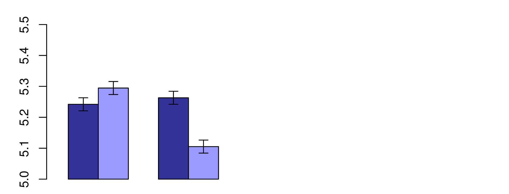
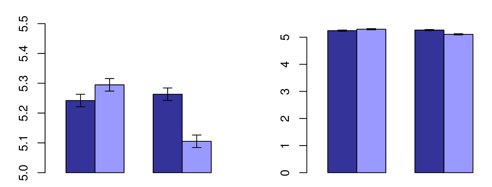
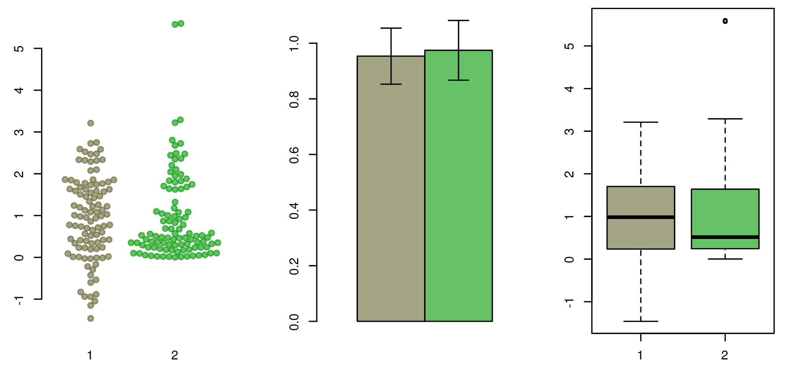
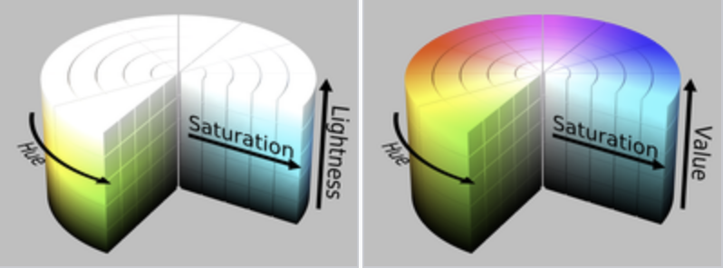
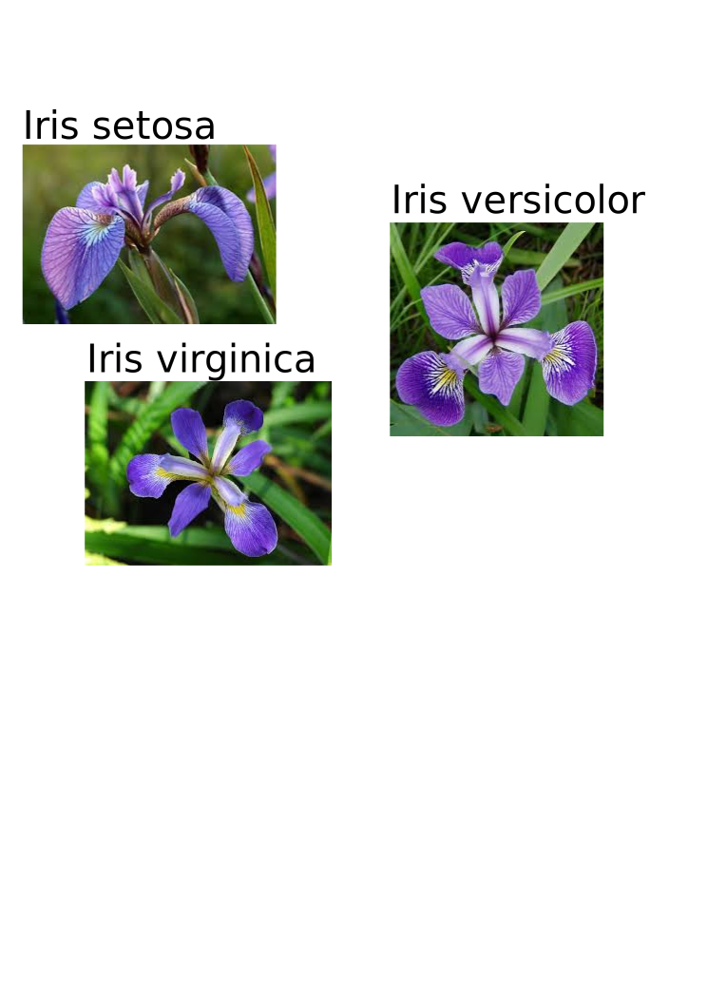

```{r,echo=FALSE}
## Set default options for the knitr RMD processing
knitr::opts_chunk$set(echo=TRUE,warning=FALSE,message=FALSE,fig.width=5,fig.height=5,cache=FALSE,autodep=TRUE, results="hide",dev="svg")
library(pander)
library(knitr)
library(kableExtra)
#source("functions.R")
```

```{r echo=FALSE,include=FALSE,eval=TRUE}
options(crayon.enabled = TRUE)
options(crayon.colors = 256)
knitr::knit_hooks$set(output = function(x, options){
  paste0(
    '<pre class="r-output"><code>',
    fansi::sgr_to_html(x = htmltools::htmlEscape(x), warn = FALSE),
    '</code></pre>'
  )
})

## this is an ugly, ugly hack, but otherwise crayon does not LISTEN TO REASON!!!
num_colors <- function(forget=TRUE) 256
library(crayon)
assignInNamespace("num_colors", num_colors, pos="package:crayon")
```


```{r echo=FALSE,libraries,cache=FALSE}
library(tidyverse)
library(ggplot2)
library(readxl)
library(cowplot)
library(RColorBrewer)
library(cluster)
library(colorDF)
library(ggthemes)
library(ggcorrplot)
```

class:empty-slide,myinverse
background-image:url(images/napoleon.jpg)

???

Napoleon invasion 24.6 1812

 * lack of supply
 * bad roads – slow supply train
 * lack of water and heat
 * desertion

---

class:empty-slide,myinverse
background-image:url(images/map_invasion.jpg)

---

.mycenter[
Charles Joseph Minard
]

???

1781-1870

civil engineer: dams, canals, bridges

napoleon campaign map – 1869

retired with 70

---
class:empty-slide,myinverse
background-image:url(images/minard.png)

---
class:empty-slide,myinverse
background-image:url(images/minard_english.png)

---

.mycenter[A gallery of bioinformatic visualisations]

---
class:empty-slide,myinverse
background-image:url(images/taco.webp)

???

https://www.nature.com/articles/ncomms10519

---
## Density plots

```{r densityplots,eval=FALSE,echo=FALSE}
data(mpg)
ggplot(mpg, aes(cty, fill=factor(cyl))) +
	geom_density(alpha=0.8) +
    labs(title="Density plot",
         subtitle="City Mileage Grouped by Number of cylinders",
         caption="Source: mpg",
         x="City Mileage",
         fill="# Cylinders")
```


.center[
```{r densityplots,echo=FALSE,fig.width=9,fig.height=4.5,dev="svg"}
```
]

---
## Correlograms

```{r correlogram,eval=FALSE}
library(ggcorrplot)

# Correlation matrix
data(mtcars)
corr <- round(cor(mtcars), 1)

# Plot
ggcorrplot(corr, hc.order = TRUE, 
           type = "lower", 
           lab = TRUE, 
           lab_size = 3, 
           method="circle", 
           colors = c("tomato2", "white", "springgreen3"), 
           title="Correlogram of mtcars", 
           ggtheme=theme_bw)
```

---


## Correlograms

.center[
```{r correlogram,echo=FALSE,fig.width=9,fig.height=5.5,dev="svg"}
```
]


---
class:empty-slide,myinverse
background-image:url(images/sequence_bundle.webp)

???

https://bmcproc.biomedcentral.com/articles/10.1186/1753-6561-8-S2-S8

Sequence Bundles comparing amino acid distribution and correlation in the AKL domain. Bundled visualisation plots sequences as stacked lines against a Y-axis of letters arranged on a scale representing amino acid hydrophobicity. The lines' curved paths expose the conservation of residues by converging at matched positions. Their place relative to letters on the Y-axis exposes patterns in functionality. The consensus sequence is indicated. Lines representing two groups of organisms differ by colour: Gram-positive bacteria (black lines) and Gram-negative bacteria (blue lines). The visualisation is generated from a total of 1809 AKL protein sequences. The number of samples is: 923 Gram-negative sequences vs. 886 Gram-positives, which is in 100:96 ratio.

---
class:empty-slide,myinverse
background-image:url(images/reassortment.gif)

???

https://pubmed.ncbi.nlm.nih.gov/23939975/

"Reassortment and migration analysis of Crimean-Congo haemorrhagic fever
virus"

Predicted migration events for (a) S_dataset_a and (b) S_dataset_b using migraphyla and the estimated trees in Fig. 3. The colours of the inner and outer circles represent the source and sink countries. A space between the inner and outer circles indicates the virus was transmitted from the country on the inner circle to the country on the outer circle. In contrast, if the inner and outer circles are connected, this means the virus is transmitted from the country on the outer circle to the country on the inner circle. The width of the link between two countries corresponds to the number of migration events and colour of the link represents the origin of migration. Grey links indicate migration events with a significant P value, but lacking sFDR support. Only migration events with P<0.05 are shown. See Fig. 3 for abbreviations.

---
class:empty-slide,myinverse
background-image:url(images/mechanical.png)

???

https://journals.plos.org/plosone/article?id=10.1371/journal.pone.0204309

E - Elastic

G – shear

epsilon – strain to failure

sigma t – tensile strength

sigma c – compressive strength

sigma f – flexural strength

KIC fracture toughness

uR resillience

H hardness

IS impact strength

---
class:empty-slide,myinverse
background-image:url(images/Coexpression-clustering1.jpg)

???

https://www.nature.com/articles/nature13182

Collapsed coexpression network derived from 4,882 coexpression groups (one node is one
group of promoters; 4,664 groups are shown here) derived from expression profiles of
124,090 promoters across all primary cell types, tissues and cell lines (visualized using
Biolayout Express3D (ref. 45), r > 0.75, MCLi = 2.2). For display, each group of promoters
is collapsed into a sphere, the radius of which is proportional to the cube root of the number
of promoters in that group. Edges indicate r > 0.6 between the average expression profiles of
each cluster. Colours indicate loosely-associated collections of coexpression groups (MCLi
= 1.2). Labels show representative descriptions of the dominant cell type in coexpression
groups in each region of the network, and a selection of highly-enriched pathways (FDR <
10−4) from KEGG (K), WikiPathways (W), Netpath (N) and Reactome (R). Promoters and
genes in the coexpression groups are available online a

---
class:empty-slide,myinverse
background-image:url(images/wordcloud.png)

---

## Edward Tufte

.pull-left[
.center[
*“Graphical excellence is that which  
gives to the viewer the greatest
number of ideas in the shortest time 
with the least ink in the smallest
space.”*
]
]

.pull-right[

]

---
class:empty-slide,mywhite
background-image:url(images/tufte-books.png)

---

.mycenter[
Data visualization is all about communication.

Just like in graphics design, less is more. 

To get a good graphics remove
all excess ink.
]

---

## Reproducibility of visualisations

 * It should be absolutely clear what data was used to generate the
   visualization
 * The data must be accessible (some journals require a data file for each
   figure!)
 * The visualization code should likewise be published


---

## Checklist for making graphs

 * What do I want to say?
 * What do I *need* to say? 
 * What part of my information is redundant?
 * What is the standard way of displaying the information in my field?
 * Is the data accessible for others?

Resist the temptation of showing every bit of data. If necessary, put it in
the supplementary materials.

---

## Average MPG depending on number of cylinders

```{r barplot_01,eval=FALSE}
```

---

## All bells and whistles


```{r barplot_01,fig.width=6,fig.height=5,echo=FALSE}
p <- mtcars %>% group_by(cyl) %>% 
      summarise(mean_mpg=mean(mpg)) %>%
      mutate(cyl=factor(cyl)) %>% 
      ggplot(aes(x=cyl, y=mean_mpg, fill=cyl))
p + geom_bar(stat="identity", mapping=aes(fill=cyl)) + 
  theme(axis.line=element_line(size=1, arrow=arrow(length=unit(0.1, "inches"))))

```

---

.mycenter[*“Clutter and confusion are failures of design, not attributes of
information.”* (Tufte)]

---

## Remove legend


```{r barplot_02,fig.width=6,fig.height=5,echo=FALSE}
p + geom_bar(stat="identity", mapping=aes(fill=cyl)) + 
  theme(legend.position="none", 
    axis.line=element_line(size=1, arrow=arrow(length=unit(0.1, "inches"))))

```

---

## Remove axes

```{r barplot_03,fig.width=6,fig.height=5,echo=FALSE}
p + geom_bar(stat="identity", mapping=aes(fill=cyl)) + 
  theme(legend.position="none")
```

---

## Remove color

```{r barplot_04,fig.width=6,fig.height=5,echo=FALSE}
p + geom_bar(stat="identity", fill="#666666") + 
  theme(legend.position="none")
```

---

.mycenter[
Do not use more than one channel to display given information. If you use X
axis to differentiate between groups, do not use color to do the same.
]

---

## Narrow bars

```{r barplot_05,fig.width=6,fig.height=5,echo=FALSE}
p + geom_bar(stat="identity", fill="#666666", width=0.5) + 
  theme(legend.position="none")
```

---

## Remove vertical grid

```{r barplot_06,fig.width=6,fig.height=5,echo=FALSE}
p + geom_bar(stat="identity", fill="#666666", width=0.5) + 
  theme(legend.position="none", panel.grid.major.x=element_blank())
```
---


## Remove grey background

```{r barplot_07,fig.width=6,fig.height=5,echo=FALSE}
p + geom_bar(stat="identity", fill="#666666", width=0.5) + 
  theme(legend.position="none", panel.grid.major.x=element_blank(), 
    panel.ontop=T, panel.background=element_rect(fill="#FFFFFF00"), 
    panel.grid.major.y=element_line(size=1, color="white"), 
    panel.grid.minor.y=element_line(size=1, color="white"))
```

---

## Add meaningful labels

.pull-left[
```{r barplot_01b,fig.width=6,fig.height=5,echo=FALSE}
p <- mtcars %>% group_by(cyl) %>% 
      summarise(mean_mpg=mean(mpg)) %>%
      mutate(cyl=factor(cyl)) %>% 
      ggplot(aes(x=cyl, y=mean_mpg, fill=cyl))
p + geom_bar(stat="identity", mapping=aes(fill=cyl)) + 
  theme(axis.line=element_line(size=1, arrow=arrow(length=unit(0.1, "inches"))))
```
]


.pull-right[
```{r barplot_08,fig.width=6,fig.height=5,echo=FALSE}
p + geom_bar(stat="identity", fill="#666666", width=0.5) + 
  theme(legend.position="none", panel.grid.major.x=element_blank(), 
    panel.ontop=T, panel.background=element_rect(fill="#FFFFFF00"), 
    panel.grid.major.y=element_line(size=1, color="white"), 
    panel.grid.minor.y=element_line(size=1, color="white")) + 
    ylab("Mean MPG") + xlab("Number of cylinders")
```
]


---

```{r echo=FALSE}
library(cowplot)
theme_set(theme_linedraw())
```

---


.pull-left[
### Box plots: default R:

```{r boxplot_01,fig.width=8,fig.height=5}
boxplot(hwy ~ class, data=mpg)
```
]

.pull-right[
### Box plots: ggplot2

```{r boxplot_3,eval=TRUE}
mpg %>% ggplot(aes(x=class, y=hwy)) + geom_boxplot()
```
]


---

## Box + scatter plots

.pull-left[
```{r boxplot_4,eval=FALSE}
mpg %>% ggplot(aes(x=class, y=hwy)) + 
  geom_boxplot() +
	geom_dotplot(binaxis="y", 
               stackdir="center", 
               fill="grey", 
               dotsize=.3)
```
]

.pull-right[

```{r boxplot_4,echo=FALSE,fig.width=8,fig.height=5}
```

]

---

## Box plots: Tufte

.pull-left[
```{r boxplot_02,fig.width=8,fig.height=5,eval=FALSE}
```

]

.pull-right[
```{r boxplot_02,fig.width=8,fig.height=5,echo=FALSE}
toupper1st <- function(x) 
  paste0(toupper(substring(x, 1, 1)), 
         substring(x, 2))
mpg %>% mutate(class=toupper1st(class)) %>% 
  ggplot(aes(class, hwy)) + 
  geom_tufteboxplot() + 
  theme_tufte() + xlab("") + 
  theme(axis.text=element_text(size=14), 
        axis.title.y=
          element_text(size=18, 
                       margin=margin(0,20,0,0))) +
  theme(axis.ticks.x=element_blank()) +
  theme(axis.text.x=
        element_text(margin=margin(30,0,0,0)))
```
]

---

.center[
```{r scatter_themes,fig.width=10,fig.height=5.5,echo=FALSE}
p <- list()
p$p1 <- ggplot(mtcars, aes(x=disp, y=hp, color=factor(cyl))) + geom_point() 
p$p2 <- ggplot(mtcars, aes(x=disp, y=hp, color=factor(cyl))) + geom_point() + 
  theme_par()
p$p3 <- ggplot(mtcars, aes(x=disp, y=hp, color=factor(cyl))) + geom_point() + 
  theme_cowplot()
p$p4 <- ggplot(mtcars, aes(x=disp, y=hp, color=factor(cyl))) + geom_point() + 
  theme_tufte()

p <- map(p, ~ . + theme(plot.margin=margin(20, 0, 0, 0)))
plot_grid(plotlist=p, labels=c("Default", "Par", "Cowplot", "Tufte"))
```
]

---

.mycenter[
*“Above all else show the data.”* (Tufte)
]

---


.mycenter[
Common problems and solutions
]

---

## Avoid bar charts

 * Bar charts have their purpose: showing proportions or absolute
   quantities (1 value per bar)
 * Y axis must always start at 0, because bar charts communicate with the
   bar surface area
 * Bar charts are often misused to show sample means and sample spread;
   they should be replaced by box plots, violin plots or dot plots.
   

*Editorial. "Kick the bar chart habit." Nature Methods 11 (2014): 113.*

---



.myfootnote[
*Kramer, Adam DI, Jamie E. Guillory, and Jeffrey T. Hancock. "Experimental evidence of massive-scale emotional contagion through social networks." Proceedings of the National Academy of Sciences 111.24 (2014): 8788-8790.*
]

---



.myfootnote[
*Kramer, Adam DI, Jamie E. Guillory, and Jeffrey T. Hancock. "Experimental evidence of massive-scale emotional contagion through social networks." Proceedings of the National Academy of Sciences 111.24 (2014): 8788-8790.*
]

---



---


## Avoid pie charts

 * Pie charts are bad at communicating information, just don't use them
 * Don't even mention 3D pie charts
 * There are tons of alternatives to pie charts

---

```{r,echo=FALSE}
wigplot <- function(i) {
  require(plotwidgets)
  par(mar=rep(0, 4))
  par(mfrow=c(2, 4))
  par(usr=c(0,1,0,1))

  v <- c(.3, .8, .7, .4, .5)
  col <- plotPals("zeileis")

  plot.new()
  wgPie(.5, .5, .8, .8, v, col=col, res=1000)

  if(i > 0) {
    plot.new()
    wgRing(.5, .5, .8, .8, v, col=col, res=1000)
  }
  if(i > 1) {
    plot.new()
    wgBurst(.5, .5, .8, .8, v, col=col, res=1000)
  }
  if(i > 2) {
    plot.new()
    wgBoxpie(.5, .5, .8, .8, v, col=col)
  }
  if(i > 3) {
    plot.new()
    wgPlanets(.5, .5, .8, .8, v, col=col, res=1000)
  }
  if(i > 4) {
    plot.new()
    wgRug(.5, .5, .8, .8, v, col=col)
  }
  if(i > 5) {
    plot.new()
    wgBarplot(.5, .5, .8, .8, v, col=col)
  }
}
```

```{r echo=FALSE,fig.width=10,fig.height=7,dev="svg"}
wigplot(0)
```

---


```{r echo=FALSE,fig.width=10,fig.height=7,dev="svg"}
wigplot(1)
```

---


```{r echo=FALSE,fig.width=10,fig.height=7,dev="svg"}
wigplot(2)
```

---


```{r echo=FALSE,fig.width=10,fig.height=7,dev="svg"}
wigplot(3)
```

---


```{r echo=FALSE,fig.width=10,fig.height=7,dev="svg"}
wigplot(4)
```

---


```{r echo=FALSE,fig.width=10,fig.height=7,dev="svg"}
wigplot(5)
```

---


```{r echo=FALSE,fig.width=10,fig.height=7,dev="svg"}
wigplot(6)
```

---
class:empty-slide,mywhite
background-image:url(images/pacman.png)


---


.mycenter[

It is not important which tools you use. It is important that you first
come up with the idea how you want the data to be plotted, and that you can
plot it – with whatever means you can. (Where should you look for a lost
watch?)

]

---

## Bitmap vs vector graphics

.pull-left[
Bitmap graphics (JPG, PNG, TIFF)

```{r echo=FALSE,dev="png",out.width="200%",out.height="200%"}
wigplot(2)
```
]

--

.pull-right[
Vector graphics (PDF¹, SVG)

```{r,dev="svg",echo=FALSE}
wigplot(2)
```
]

.myfootnote[
  ¹ PDF and SVG can also include bitmap graphics, so converting
a bitmap file to PDF does not result in a higher quality.
]

---


## Example session
 
We will now use world inequality data to create a bar plot.

WIID (world income inequality database) includes quintiles of the income
distribution. 

E.g. if $q_{1} = 10$, it means that the lower (in terms of income) $1/5$ of the population
gets 10% of the total GDP.

In other words, if we order 100 persons according to their income, from
lowest to highest, then the first 20 are getting 10% of the overall income.

The closer the quintiles are to 20% for each group, the more egalitarian
the society.

---

First, we prepare the data using tidyverse.

```{r wid,fig.width=8,fig.height=5,out.width="50%"}
wid <- read_excel("../../Datasets/WIID_19Dec2018.xlsx")
wid <- wid %>% drop_na(gini_reported, q1:q5, d1:d10)
wid2015 <- wid %>% filter(year==2015 & 
                          region_un == "Europe" & 
                          population > 5e6)
wid2015sel <- wid2015  %>% 
  filter(quality=="High") %>%
  filter(!duplicated(country)) %>% 
  select(country, gini_reported, q1:q5, d1:d10)

## we mess the quantiles on purpose
data <- wid2015sel %>% 
  gather(q1:q5, key="quantile", value="proportion") %>%
  mutate(quantile=factor(quantile, levels=paste0("q", c(2, 1, 5, 4, 3))))
```

---

## Example session

Now we pass the data to ggplot.

```{r wid01,fig.width=8,fig.height=5,eval=FALSE,out.width="50%"}
p <- data %>%
  ggplot(aes(country, proportion, fill=quantile)) +
  geom_bar(stat="identity") + coord_flip()
p
```

 * `coord_flip()` so the bar plot is horizontal
 * `geom_bar()` uses the `fill` esthetics

---

## Example session
 
.center[
```{r wid01,fig.width=8,fig.height=5,echo=FALSE,out.width="70%"}
```
]

---

## First, reorder the quantile factor

```{r wid2,fig.width=8,fig.height=5,out.width="50%"}
data <- data %>% mutate(quantile=factor(quantile, levels=paste0("q", 5:1)))
p <- data %>%
  ggplot(aes(country, proportion, fill=quantile)) +
  geom_bar(stat="identity") + coord_flip()
p
```

---

## Reorder the countries

```{r wid3,fig.width=8,fig.height=5,out.width="50%"}
data <- wid2015sel %>% 
  mutate(country=reorder(country, desc(gini_reported))) %>%
  gather(q1:q5, key="quantile", value="proportion") %>%
  mutate(quantile=factor(quantile, levels=paste0("q", 5:1)))
p <- data  %>%
  ggplot(aes(country, proportion, fill=quantile)) +
  geom_bar(stat="identity") + coord_flip()
p
```

---

## Make it nice!

```{r wid4,fig.width=8,fig.height=5,out.width="50%",eval=FALSE}
p + theme_tufte() + scale_fill_brewer(palette="Blues") +
  ylab("Proportion of wealth") + xlab("Country") +
  guides(fill=guide_legend(reverse=TRUE))
```

---

## Make it nice!

.center[
```{r wid4,fig.width=8,fig.height=5,out.width="70%",echo=FALSE}
```
]

---


### Eine kleine Farbenlehre

Farbenlehre = Color theory

 * What is the function of color on the plot?
 * Does the color help or distract?
 * Do I *really* need color?
 * If you need more than five distinct colors (I don't mean a gradient),
   you probably are doing something
   wrong.

---

## Representing colors

There are many ways to represent colors. In R, we most frequently use the
RGB scheme in which each color is composed of three values for each of the
three colors: red, green and blue.

One way is to choose values between 0 and 1; another, between 0 and 255.
The latter can be represented using hexadecimal notation, in which the
value goes from 0 to FF (`15 * 16 + 15 = 255`). This is a very common
notation, used also in HTML:

  * `"#FF0000"` or `c(255, 0, 0)`: red channel to the max, blue and green
    to the minimum. The result is color red.
  * `"#00FF00"`: bright green
  * `"#000000"`: black
  * `"#FFFFFF"`: white

---

## Getting the colors

   * To get the color from numbers in 0…1 range:

        rgb(0.5, 0.7, 0) # returns "#80B300"

   * To get the color from numbers in 0…255 range:
       
        rgb(255, 128, 0, maxColorValue=255)

---

## Alpha channel: transparency

Useful way to handle large numbers of data points. `#FF000000`: fully
transparent; `#FF0000FF`: fully opaque.

```{r scatter,fig.width=8,fig.height=4,eval=FALSE}
x <- rnorm(10000)
y <- x + rnorm(10000)
p1 <- ggplot(NULL, aes(x=x, y=y)) + geom_point() + 
  theme_tufte() + theme(plot.margin=unit(c(2,1,1,1), "cm"))
p2 <- ggplot(NULL, aes(x=x, y=y)) + geom_point(color="#6666661F") + 
  theme_tufte() + theme(plot.margin=unit(c(2,1,1,1),"cm"))
plot_grid(p1, p2, labels=c("Black", "#6666661F"))
```

---

## Alpha channel: transparency

Useful way to handle large numbers of data points. `#FF000000`: fully
transparent; `#FF0000FF`: fully opaque.

```{r scatter,fig.width=8,fig.height=4,echo=FALSE}
```

---


## Other color systems

There are several other representations of color space, and they do not give
exactly the same results. Two common representations are HSV and HSL: Hue,
Saturation and Value, and Hue, Saturation and Luminosity. 



---

## Manipulating colors

There are many packages to help you manipulate the colors using hsl and hsv.
For example, my package `plotwidgets` allows you to change it using the HSL model.

```{r plotwidgets,fig.width=5,fig.height=5,eval=FALSE}
library(plotwidgets)
## Now loop over hues
pal <- plotPals("zeileis")
v <- c(10, 9, 19, 9, 15, 5)

a2xy <- function(a, r=1, full=FALSE) {
  t <- pi/2 - 2 * pi * a / 360
  list( x=r * cos(t), y=r * sin(t) )
}

plot.new()
par(usr=c(-1,1,-1,1))
hues <- seq(0, 360, by=30)
pos <- a2xy(hues, r=0.75)
for(i in 1:length(hues)) {
  cols <- modhueCol(pal, by=hues[i])
  wgPlanets(x=pos$x[i], y=pos$y[i], w=0.5, h=0.5, v=v, col=cols)
}

pos <- a2xy(hues[-1], r=0.4)
text(pos$x, pos$y, hues[-1])
```

---

## Manipulating colors

There are many packages to help you manipulate the colors using hsl and hsv.
For example, my package `plotwidgets` allows you to change it using the HSL model.

.center[
```{r plotwidgets,fig.width=5,fig.height=5,echo=FALSE,dev="svg"}
```
]

---

## Palettes

It is not easy to get a nice combination of colors (see default plot in ggplot2
to see how *not* to do it).

There are numerous palettes in numerous packages.  One of the most popular is
`RColorBrewer`. You can use it with both base R and `ggplot2`.

---

## RColorBrewer palettes

```{r rcolorbrewer,fig.width=8,fig.height=5,eval=FALSE}
library(RColorBrewer)
par(mar=c(0,4,0,0))
display.brewer.all()
```

---

## RColorBrewer palettes

.center[
```{r rcolorbrewer,fig.width=10,fig.height=5,echo=FALSE}
```
]

---

## RColorBrewer palettes: color blind

```{r rcolorbrewer2,fig.width=10,fig.height=5,eval=FALSE}
```

---

## RColorBrewer palettes: color blind

.center[
```{r rcolorbrewer2,fig.width=8,fig.height=5,echo=FALSE}
par(mar=c(0,4,0,0))
display.brewer.all(colorblindFriendly=T)
```
]

---

## Iris data set

.pull-left[
```r
data("iris")
```
]

.pull-right[

]

.myfootnote[
*The use of multiple measurements in taxonomic problems as an example of linear
discriminant analysis.* Fisher 1936
]

---

## Gallery of RColorBrewer palettes: Dark2

```{r pals01,fig.width=8,fig.height=5,echo=FALSE}
ggplot(iris, aes(x=Sepal.Length, y=Sepal.Width, color=Species)) + 
  geom_point(size=4) + 
  scale_color_brewer(palette="Dark2") + 
  theme_tufte() + 
  theme(axis.title.y=element_text(margin=margin(0,10,0,0)), 
        axis.title.x=element_text(margin=margin(10, 0, 0, 0)))
```

---

## Pastel1

```{r pals02,fig.width=8,fig.height=5,echo=FALSE}
ggplot(iris, aes(x=Sepal.Length, y=Sepal.Width, color=Species)) + 
  geom_point(size=4) + scale_color_brewer(palette="Pastel1")  + theme_tufte() + 
  theme(axis.title.y=element_text(margin=margin(0,10,0,0)), 
        axis.title.x=element_text(margin=margin(10, 0, 0, 0)))
```

---


## Paired

```{r pals03,fig.width=8,fig.height=5,echo=FALSE}
ggplot(iris, aes(x=Sepal.Length, y=Sepal.Width, color=Species)) + 
  geom_point(size=4) + scale_color_brewer(palette="Paired") + theme_tufte() + 
  theme(axis.title.y=element_text(margin=margin(0,10,0,0)), 
        axis.title.x=element_text(margin=margin(10, 0, 0, 0)))
```

---

## Set2

```{r pals04,fig.width=8,fig.height=5,echo=FALSE}
ggplot(iris, aes(x=Sepal.Length, y=Sepal.Width, color=Species)) + 
  geom_point(size=4) + scale_color_brewer(palette="Set2") + theme_tufte() + 
  theme(axis.title.y=element_text(margin=margin(0,10,0,0)), 
        axis.title.x=element_text(margin=margin(10, 0, 0, 0)))
```

---

## The viridis scale

For base R, use the following code:

```{r viridis1,fig.width=8,fig.height=5}
library(scales)
pal <- viridis_pal()(n=6)
show_col(pal)
```

---

## The viridis scale

Implemented in ggplot functions:

 * `scale_(color|fill)_viridis_(c|d)`
 * `c` for continuous, `d` for discrete
 
e.g. 

```{r pals_viridis,fig.width=8,fig.height=5,eval=FALSE}
ggplot(iris, aes(x=Sepal.Length, y=Sepal.Width, color=Species)) + 
  geom_point(size=4) + scale_color_brewer(palette="Set2") + theme_tufte() + 
  theme(axis.title.y=element_text(margin=margin(0,10,0,0)), 
        axis.title.x=element_text(margin=margin(10, 0, 0, 0))) +
  scale_color_viridis_d()
```

---

## The viridis scale

```{r pals_viridis,fig.width=8,fig.height=5,echo=FALSE}
```

---


## Other sources

 * my package `plotwidgets` implements a couple of other palettes
 * You can always define your own colors!
 * Use a color picker to "steal" palettes that you think are nice
 * You can use [this tool](https://davidmathlogic.com/colorblind/) 
   or [this one](https://projects.susielu.com/viz-palette)
   to design colorblind friendly palettes

---

## plotwidget palettes


```{r plotwidgetspals,echo=FALSE,fig.width=8,fig.height=5,out.width="70%"}
par(mar=c(0,4,0,0))
library(plotwidgets)
showPals()
```

---

## The gapminder data set

```{r eval=FALSE}
library(gapminder)
data(gapminder)
```


---

.mycenter[

Gallery of shame

]

---
class:empty-slide,myinverse
background-image:url(images/useless_murders.jpg)

---
class:empty-slide,myinverse
background-image:url(images/useless_deaths.jpg)

---
class:empty-slide,myinverse
background-image:url(images/useless_welfare.png)

---
class:empty-slide,myinverse
background-image:url(images/useless_welfare.png)

---
class:empty-slide,myinverse
background-image:url(images/useless_global_warming.png)


---
class:empty-slide,myinverse
background-image:url(images/useless_global_warming_2.png)


---


## From data to figures

 * What is the message of the figure?
 * What data should be shown on a plot?
 * What relationships do you want to illustrate?
 * If it is tricky – I start with a pencil and a clean piece of paper!

---


## Factfulness

.mycenter[
*“The world cannot be understood without numbers. But the world cannot be understood with numbers alone.”*

― Hans Rosling, Factfulness: *Ten Reasons We're Wrong About the World—and Why Things Are Better Than You Think*
]

---


## Loading the gapminder data set

```{r results="markdown"}
library(ggplot2)
theme_set(theme_bw())
library(gapminder)
knitr::kable(head(gapminder))
```

---


## First plot

```{r fig.width=6,fig.height=4.5}
gapminder %>% ggplot(aes(x=gdpPercap, y=lifeExp, color=year)) + geom_point()
```

---


## First plot

```{r fig.width=6,fig.height=4.5}
gapminder %>% ggplot(aes(x=gdpPercap, y=lifeExp, color=year)) + geom_point() +
  scale_x_log10()
```

---


## First plot

```{r fig.width=6,fig.height=4.5}
gapminder %>% ggplot(aes(x=gdpPercap, y=lifeExp, color=year)) + geom_point() +
  scale_x_log10() + scale_color_viridis_c()
```

---


## Select only one year

```{r fig.width=6,fig.height=4.5}
gapminder %>% filter(year==2007) %>%
  ggplot(aes(x=gdpPercap, y=lifeExp, color=continent)) + geom_point() +
  scale_x_log10() + scale_color_brewer(palette="Dark2")
```

---


## Add population data

```{r fig.width=6,fig.height=4.5}
gapminder %>% filter(year==2007) %>%
  ggplot(aes(x=gdpPercap, y=lifeExp, size=pop, color=continent)) + geom_point() +
  scale_x_log10() + scale_color_brewer(palette="Dark2")
```

---


## Nicer colors from gapminder

```{r fig.width=6,fig.height=4.5}
gapminder %>% filter(year==2007) %>%
  ggplot(aes(x=gdpPercap, y=lifeExp, size=pop, color=country)) + 
  geom_point(alpha=.7, show.legend=FALSE) +
  scale_color_manual(values=country_colors) +
  scale_x_log10()
```

---


## Comparison year 1952 and 2007

```{r gapminder1,eval=FALSE}
g1952 <- gapminder %>% filter(year == 1952) %>%
  ggplot(aes(x=gdpPercap, y=lifeExp, color=continent)) + geom_point() +
  scale_color_brewer(palette="Dark2") +
  xlim(range(gapminder$gdpPercap)) + 
  ylim(range(gapminder$lifeExp)) + scale_x_log10()

g2007 <- gapminder %>% filter(year == 2007) %>%
  ggplot(aes(x=gdpPercap, y=lifeExp, color=continent)) + geom_point() +
  scale_color_brewer(palette="Dark2") +
  xlim(range(gapminder$gdpPercap)) + 
  ylim(range(gapminder$lifeExp)) + scale_x_log10()

plot_grid(g1952, g2007)
```

---


## Comparison year 1952 and 2007

```{r gapminder1,echo=FALSE,eval=TRUE,fig.width=10,fig.height=4.5}
```

---


## Comparison year 1952 and 2007

Much easier!

```{r,fig.width=8,fig.height=4}
gapminder %>% filter(year %in% c(1952, 2007)) %>%
  ggplot(aes(x=gdpPercap, y=lifeExp, color=continent)) +
  scale_color_brewer(palette="Dark2") +
  geom_point() + facet_grid(. ~ year) + scale_x_log10()
```

---


## Add population data

```{r,fig.width=8,fig.height=4}
gapminder %>% filter(year %in% c(1952, 2007)) %>%
  ggplot(aes(x=gdpPercap, y=lifeExp, size=pop, color=continent)) +
  scale_color_brewer(palette="Dark2") +
  geom_point() + facet_grid(. ~ year) + scale_x_log10()
```

---


## Slope diagram

```{r gapminder_slope,eval=FALSE}
tmp <- gapminder %>% filter(year %in% c(1952, 2007)) %>% 
  group_by(continent, year) %>% 
  summarise(mean=mean(gdpPercap), median=median(gdpPercap))
tmp %>% ggplot(aes(x=year, y=mean, color=continent)) + 
  geom_point() + geom_line() + 
  scale_y_log10() + 
  geom_label(aes(label=continent), hjust="outward", show.legend=F) + xlim(1945, 2020)
```

---


## Slope diagram

```{r gapminder_slope,echo=FALSE,fig.width=7}
```

---


## Dumbbell chart

```{r gapminder_dmb,eval=FALSE}
gapminder %>% filter(year %in% c(1952, 2007) & continent=="Europe") %>% 
  arrange(gdpPercap, year) %>% 
  mutate(country=factor(country, levels=unique(country))) %>%
  ggplot(aes(x=gdpPercap, y=country, color=year)) + 
  geom_point() + geom_line()
```

---


## Dumbbell chart

```{r gapminder_dmb,echo=FALSE,fig.width=10,fig.height=4.5}
```

---


## Let's move it

```{r gganim,eval=FALSE}
library(gganimate)
g <- gapminder %>% ggplot(aes(x=gdpPercap, y=lifeExp, size=pop, color=continent)) + 
  geom_point(alpha=.8) + 
  scale_color_brewer(palette="Dark2") +
  scale_x_log10() + 
  scale_size(range = c(2, 12)) +
  transition_time(year) + 
  labs(title = 'Year: {frame_time}', x = 'GDP per capita', y = 'life expectancy') +
  ease_aes("linear")

animate(g, duration = 15, fps = 20, width = 800, height = 500, renderer = av_renderer())
anim_save("gapminder.mp4")
```

**Warning:** `gganimate` has *huge* installation requirements, because you
need a renderer library. Depending on your system, this might take a lot of
disk space / a lot of headache. For example, using the `gifski` package
requires you to install the rust environment. Also, including in rmarkdown
might be problematic.

---


## Let's move it

<video controls autoplay><source src="images/gapminder.mp4" type="video/mp4"></video>

