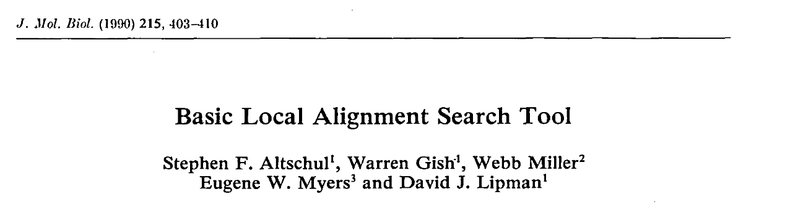

```{r,echo=FALSE}
## Set default options for the knitr RMD processing
knitr::opts_chunk$set(echo=FALSE,warning=FALSE,message=FALSE,fig.width=5,fig.height=5,cache=FALSE,autodep=TRUE, results="hide")
```

```{r libraries,cache=FALSE}
library(tidyverse)
```


---

## The BLAST algorithm

BLAST – Basic Local Alignment Search Tool




---

## The BLAST algorithm


---

## The BLAST algorithm


 * Advantage: $O(n)$ – linear time complexity
 * Compromise between speed and sensitivity
 * Heuristic, not exact
 * Primary output: HSP, high scoring segment pairs (possibly multiple per
   sequence pair)

---

## Important BLAST parameters

 * Type of BLAST (which program)
 * Database (more on that tomorrow)
 * Word size (lower word size = slower but more sensitive)
 * Filter low complexity regions (e.g. repeats)

---

## BLAST E-value

 * Expected number of HSP's which have a score equal or better to the given
   result
 
  $E = m\cdot n\cdot 2^{-S'}$

  where $S'$ is a normalized score and $m$ and $n$ are sequence lengths.

---

## BLAST programs

```{r results="markdown"}
tmp <- read.table(text='
Program Description Input      Database
blastn  "Search sequence against sequence" Nucleotide Nucleotide
blastp  "Search sequence against sequence" Protein    Protein
blastx  "Translate query in all open reading frames" Nucleotide Protein
tblastn "Translate database in all open reading frames" Protein    Nucleotide
', header=TRUE)
knitr::kable(tmp)

```

---

## Databases

 * [NCBI Genbank](https://www.ncbi.nlm.nih.gov/genbank/)
    * Refseq (reference sequences, curated)
    * nr – Non-redundant (almost all known sequences)
    * Environmental sequences
    * Entrez Gene – gene centered, provides Entrez identifiers
 * [SwissProt / Uniprot](https://uniprot.org) – protein sequences
 * [PDB - Protein Databank](https://www.wwpdb.org) – protein structure database
 * [Ensembl](https://ensembl.org) – Ensembl genome browser and database
